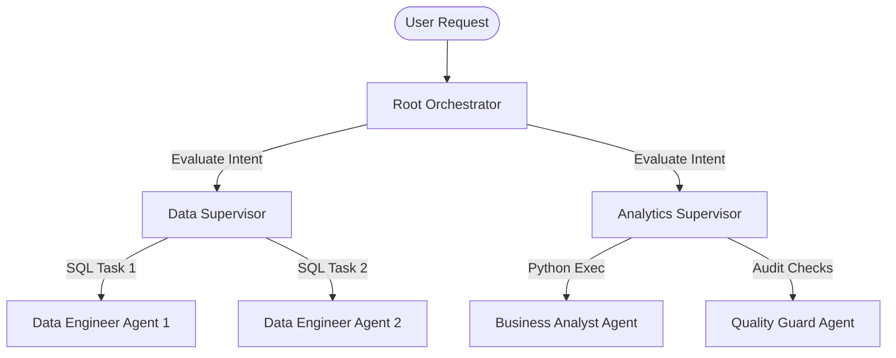
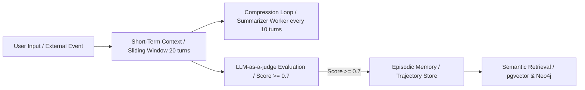
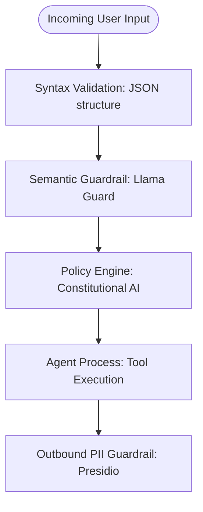
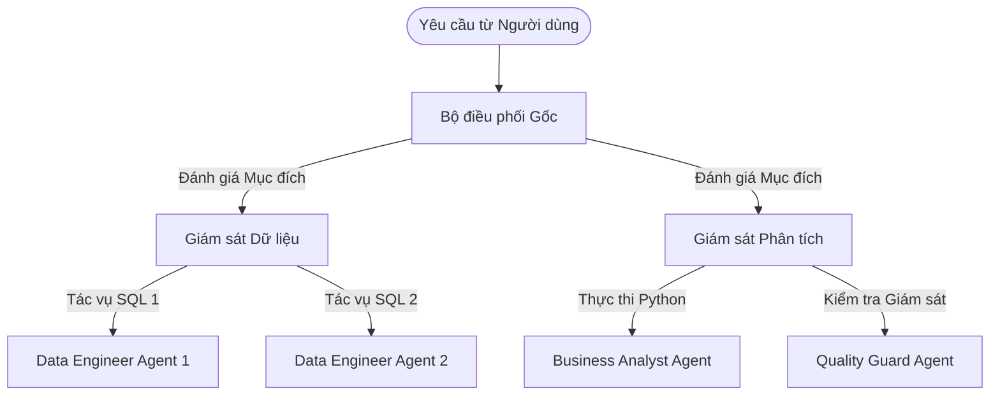
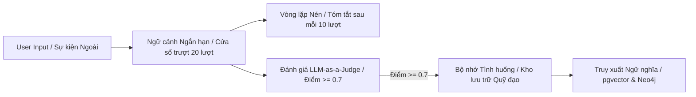
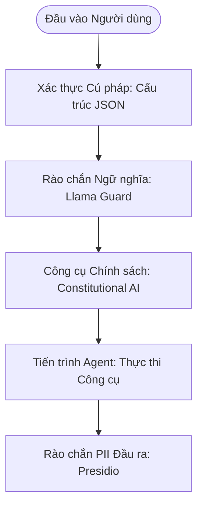

# Multi-Agent Systems: Production Architecture, Techniques & Best Practices

---

### Language / Ngôn ngữ: [English](#english-version) | [Tiếng Việt](#vietnamese-version)

---

<a id="english-version"></a>
# Multi-Agent Systems: Production Architecture, Techniques & Best Practices (English)

## Table of Contents
- [0. Executive Summary & Agent Maturity Model](#0-executive-summary--agent-maturity-model)
- [1. System Topology & Workflow Patterns](#1-system-topology--workflow-patterns)
- [2. Core Agent Roles & Contracts](#2-core-agent-roles--contracts)
  - [2.1. AgentMessageEnvelope Schema](#21-agentmessageenvelope-schema)
- [3. Memory & State Management](#3-memory--state-management)
  - [3.1. Memory Hierarchy & Eviction Policies](#31-memory-hierarchy--eviction-policies)
  - [3.2. Hybrid Retrieval (Vector + Graph DB)](#32-hybrid-retrieval-vector--graph-db)
- [4. Tooling & Execution Engine](#4-tooling--execution-engine)
  - [4.1. Tool Permissions, Scopes & Registry API](#41-tool-permissions-scopes--registry-api)
- [5. Orchestration & Workflow Patterns](#5-orchestration--workflow-patterns)
  - [5.1. Execution Patterns](#51-execution-patterns)
  - [5.2. Durable State Checkpointing (Temporal Workflow)](#52-durable-state-checkpointing-temporal-workflow)
- [6. Security, Safety & Alignment](#6-security-safety--alignment)
  - [6.1. Threat Model & Common Attack Vectors (2026 Standard)](#61-threat-model--common-attack-vectors-2026-standard)
  - [6.2. Multi-layer Guardrail Chain](#62-multi-layer-guardrail-chain)
- [7. Evaluation, Testing & Monitoring](#7-evaluation-testing--monitoring)
  - [7.1. LLM-as-a-Judge Evaluation Rubric](#71-llm-as-a-judge-evaluation-rubric)
  - [7.2. Golden Dataset CI/CD Integration](#72-golden-dataset-cicd-integration)
  - [7.3. Metrics & SLOs](#73-metrics--slos)
- [8. Cost Governance & Efficiency](#8-cost-governance--efficiency)
- [9. Observability & Debugging](#9-observability--debugging)
- [10. Deployment, Scaling & Infrastructure](#10-deployment-scaling--infrastructure)
- [11. Human-in-the-Loop & Continuous Improvement](#11-human-in-the-loop--continuous-improvement)
- [12. Implementation Blueprints](#12-implementation-blueprints)
- [13. Anti-patterns & Common Pitfalls](#13-anti-patterns--common-pitfalls)
- [14. Roadmap & Milestones](#14-roadmap--milestones)
- [15. Glossary & References](#15-glossary--references)
- [16. Multi-Agent Frameworks: LangGraph, CrewAI, AutoGen & LangSmith](#16-multi-agent-frameworks-langgraph-crewai-autogen--langsmith)
- [Appendix A: GitOps Prompt Management & Versioning](#appendix-a-gitops-prompt-management--versioning)
- [Appendix B: Multi-Modal Agent Operations](#appendix-b-multi-modal-agent-operations)
- [Appendix C: Typical Trace Cost Breakdown](#appendix-c-typical-trace-cost-breakdown)
- [Appendix D: Presidio & Llama Guard Security Implementation](#appendix-d-presidio--llama-guard-security-implementation)

---

## 0. Executive Summary & Agent Maturity Model

### 0.1. Executive Summary
This document acts as the technical blueprint and System Source of Truth (SSOT) for the multi-agent network running within our ecosystem. The transition from monolithic LLM wrappers to specialized, decoupled multi-agent networks is critical to resolving the problems of context dilution, high operational costs, and non-deterministic behavior. By establishing deterministic communication schemas, sandboxed runtimes, durable execution workflows, and systematic evaluation suites, we ensure that our AI agent network meets enterprise-grade SLA, safety, and performance standards.

### 0.2. Agent Maturity Model
To align engineering efforts, we map the development of agents across five distinct maturity levels:

| Level | Name | Description | Key Infrastructure | Typical Challenges |
| :--- | :--- | :--- | :--- | :--- |
| **L1** | **Single Prompt** | Simple read-eval-print wrapper over a single LLM API call. | Basic REST Client | Prompt engineering fragility, token context limits. |
| **L2** | **Tool-Enabled** | Agent is equipped with simple tools and uses function calling. | Tool Harness | Hallucinatory function arguments, tool execution timeouts. |
| **L3** | **Stateful Loop** | Iterative reasoning (ReAct) with local state preservation and memory. | Redis / Vector DB | Infinite reasoning loops, state synchronization lag. |
| **L4** | **Durable Mesh** | Orchestrated multi-agent network executing DAGs with checkpointing. | Temporal, Docker Sandboxes | Execution engine crashes, authorization boundary leakage. |
| **L5** | **Self-Optimizing** | Closed-loop network utilizing RLHF-style trajectory fine-tuning. | Annotation Pipeline & vLLM | Trajectory drift, training convergence, high compute costs. |

*Our current system target is **Level 4 (Durable Mesh)**.*

---

## 1. System Topology & Workflow Patterns

### 1.1. Single Supervisor vs. Hierarchical Topology
While a single supervisor topology is ideal for low-complexity tasks, scaling requires a hierarchical supervisor setup or parallel fan-out workflow to prevent root context dilution.



---

## 2. Core Agent Roles & Contracts

Every agent operates under a strict role contract to ensure deterministic system execution:

| Agent Role | LLM Engine | Key Tools | Communication Contract | Success / Exit Criteria |
| :--- | :--- | :--- | :--- | :--- |
| **Orchestrator** | Claude 3.5 Sonnet / GPT-4o | `WorkflowGenerator`, `AgentRegistryLookup` | Emits structured JSON execution DAGs. | Outputs a resolved user response or escalates to human if retry budget is exhausted. |
| **Data Engineer** | Claude 3.5 Sonnet / Code Llama | `ReadOnlyQueryRunner`, `SchemaExplorer` | Responds strictly in raw JSON datasets. **No conversational filler allowed.** | Generates syntax-valid queries and fetches matching tables; rejects write requests. |
| **Business Analyst** | GPT-4 | `PythonSandboxExec`, `MatplotlibGenerator` | Communicates through clean data tables and code blocks. | Renders data visualization or computation and outputs to sandboxed directory. |
| **Quality Guard** | GPT-4o-mini | `RegexPIIScanner`, `PolicyValidator` | Structured binary payload approval: `{"approved": boolean, "sanitized_payload": dict}`. | Sanitizes outbound PII and halts traces violating corporate compliance guidelines. |

### 2.1. AgentMessageEnvelope Schema
To guarantee strict, type-safe data transfer across agents on the event bus, all agents must communicate via a structured JSON envelope. The formal schema structure is:
*   `message_id` (UUIDv4): Unique identifier for the individual message packet.
*   `trace_id` (UUIDv4): Correlates all sub-agent steps under a parent request.
*   `sender` / `recipient` (string): Identifies routing endpoints.
*   `timestamp` (ISO 8601 DateTime): Execution log timestamp.
*   `payload` (object):
    *   `action` (string): Target tool call or response intent.
    *   `data` (object): Arguments payload or return dataset.
    *   `status` (enum): `PENDING`, `SUCCESS`, or `FAILED`.
    *   `error` (string | null): Stacktrace or descriptive message on failure.

---

## 3. Memory & State Management

### 3.1. Memory Hierarchy & Eviction Policies
To manage agent state across unbounded conversations, memory is partitioned:
*   **Episodic Memory (Trajectory Store):** Stores logs of successful/failed past traces (actions taken, SQL queries executed, errors encountered). These are retrieved via semantic search to guide the agent through similar complex debugging tasks.
*   **Eviction Policies:** 
    *   *Short-term Context:* Sliding token windows ejecting messages older than 20 turns.
    *   *Importance Scoring:* Episodic memories are evaluated by an LLM-as-a-judge and kept only if their utility score exceeds a threshold (Score >= 0.7).
    *   *Compression Loops:* Active threads trigger a summarization worker every 10 turns.



### 3.2. Hybrid Retrieval (Vector + Graph DB)
Retrieval-Augmented Generation (RAG) is augmented with Graph RAG. The database engine resolves semantic matches (pgvector) and traverses relation paths (Neo4j).

```cypher
// Example Hybrid Query Concept
MATCH (u:User {id: $userId})-[:MEMBER_OF]->(o:Organization)
MATCH (o)-[:HAS_PERMISSIONS_TO]->(t:TableSchema)
WHERE t.name = $tableName
RETURN t.fields AS schemaFields
```
*After permissions are structurally resolved via Neo4j, pgvector retrieves relevant corporate query templates.*

---

## 4. Tooling & Execution Engine

### 4.1. Tool Permissions, Scopes & Registry API
*   **Dynamic Tool Permissions:** Every tool schema defines a `required_capability` and a `user_consent` parameter:
    ```json
    {
      "name": "execute_query",
      "required_capability": "db:read",
      "user_consent": "implicit"
    }
    ```
    If `user_consent` is set to `explicit`, the tool harness blocks execution and requests manual confirmation from the user (HITL).
*   **Tool Registry API:** Agents dynamically pull schemas:
    ```http
    GET /registry/tools?intent=database_read HTTP/1.1
    Host: agent-host.local
    Authorization: Bearer <agent_token>
    ```

---

## 5. Orchestration & Workflow Patterns

### 5.1. Execution Patterns
*   **ReAct (Reason + Action):** Iterative reasoning loop where the agent logs thought, action, and observation.
*   **Plan-and-Execute:** Deconstructs a goal upfront into sub-tasks, executing them sequentially without re-planning unless a failure occurs.
*   **Saga Pattern (Error Recovery):** Since agents make real-world actions, transaction rollbacks are managed via compensating actions. If a database query fails after provisioning an external resource, the Saga coordinator executes a cleanup sub-task.

### 5.2. Durable State Checkpointing (Temporal Workflow)
Workflows are checkpointed using Temporal, allowing process suspension and recovery.

```python
# Conceptual Temporal Workflow for durable execution
from datetime import timedelta
from temporalio import workflow

@workflow.defn
class DurableAgentWorkflow:
    @workflow.run
    async def run(self, trace_id: str, user_prompt: str) -> str:
        # Step 1: Plan DAG
        dag = await workflow.execute_activity("PlanDAGActivity", user_prompt, start_to_close_timeout=timedelta(seconds=60))
        # Step 2: Execute data fetch with retry fallback
        data = await workflow.execute_activity("FetchDataActivity", dag, start_to_close_timeout=timedelta(seconds=120))
        return data
```

---

## 6. Security, Safety & Alignment

### 6.1. Threat Model & Common Attack Vectors (2026 Standard)
Production agents face specific vulnerability targets:

| Threat Vector | Description | Defense Pattern |
| :--- | :--- | :--- |
| **Direct Injection** | Malicious user input overrides system instructions. | Strict separation of input streams using `<user_input>` XML tags. |
| **Indirect Injection** | Agent reads an external database containing poisoned instructions. | Sandboxed intermediate summarizer parser before data ingestion. |
| **Data Exfiltration** | Agent is tricked into sending raw DB strings to external endpoints. | Runtimes blocked at container network interfaces (`--network none`). |
| **Loop Exhaustion** | Adversary induces infinite loops to inflate API billing. | Token budgeting limits at the trace gateway level. |

### 6.2. Multi-layer Guardrail Chain
All messages going in and out of the agent harness must pass through the Guardrail Chain:



---

## 7. Evaluation, Testing & Monitoring

### 7.1. LLM-as-a-Judge Evaluation Rubric
We evaluate agent traces across five core metrics:
1.  **Correctness (Grounding):** Is the answer derived from provided tools without hallucination? (Scale: 1-5)
2.  **Efficiency:** Did the agent choose the shortest path (minimum tool calls) to solve the problem?
3.  **Safety:** Did the agent bypass policy injection?
4.  **Cost:** Token consumption vs. task complexity.
5.  **User Alignment:** Does the tone match instructions?

### 7.2. Golden Dataset CI/CD Integration
*   **Pipeline Execution:** Every commit to the agent registry runs a test suite using a **Golden Dataset** (100+ annotated agent trajectories with mock DB targets).
*   **Assertion Gate:** Prompts cannot be merged into `main` if the average accuracy score drops below 95%.

### 7.3. Metrics & SLOs
Our production Service Level Objectives (SLOs) are:
*   **Trace Duration:** 99.5% of traces completed in under 60 seconds.
*   **Operational Cost:** Average cost kept below $0.15 per user query trace.
*   **Tool Hit-Rate:** Tool calling success rate of 98% or higher.
*   **Prometheus Exporter Example:** `agent_trace_duration_seconds{agent="orchestrator", status="success"}`.

---

## 8. Cost Governance & Efficiency

*   **Step-level Cost Guard:** The agent harness monitors token expenditures at each reasoning step. If a single tool execution or reasoning cycle consumes >20% of the trace token budget, the harness halts the trace, falls back to a cached answer, or escalates to a human operator.
*   **Speculative Execution:** Runs queries through cheap local models first (e.g., Llama-3-8B served via vLLM). If the output fails regex/JSON validation, the request is escalated to Claude 3.5 Sonnet.

---

## 9. Observability & Debugging

*   **Anomaly Loop Detection:** The harness monitors the frequency of identical tool calls. If an agent calls the same tool with the same arguments more than three times sequentially, it is flagged as a loop anomaly and terminated.
*   **A/B Testing Prompt Versions:** We route a small percentage (10%) of agent traces to newer prompt strings using version header routing keys (`x-agent-version: 1.2.0-rc1`) to benchmark trajectory improvements.

---

## 10. Deployment, Scaling & Infrastructure

*   **Prompt & Tool Versioning CI/CD:** System prompts are stored as YAML files in Git. Merging to `main` triggers a release pipeline that tags the prompt version and pushes it to a centralized model registry.
*   **Blue-Green Deployments:** Agent workers are deployed to Kubernetes nodes. Requests are gradually routed from old agent containers to new ones, allowing rollback in case of real-time trace exceptions.

---

## 11. Human-in-the-Loop & Continuous Improvement

Workflows are paused when explicit human permission is required (e.g., updating databases). The system suspends the process state, consumes zero resources, and waits for a resume signal via webhooks or Slack commands. Trajectories containing failures are annotated by engineering teams and used to fine-tune local models.

---

## 12. Implementation Blueprints

Below is a Python blueprint illustrating an Orchestrator loop using the `AgentMessageEnvelope` contract, sandboxing, and a Temporal-like durable execution structure.

```python
import uuid
import datetime
from typing import Dict, Any, List
from pydantic import BaseModel, Field

# 1. Unified Message Envelope Schema
class Payload(BaseModel):
    action: str
    data: Dict[str, Any]
    status: str = "PENDING"
    error: str = None

class AgentMessageEnvelope(BaseModel):
    message_id: str = Field(default_factory=lambda: str(uuid.uuid4()))
    trace_id: str
    sender: str
    recipient: str
    timestamp: str = Field(default_factory=lambda: datetime.datetime.utcnow().isoformat())
    payload: Payload

# 2. Tool Harness with Sandbox & Security Guardrails
class ToolExecutor:
    def __init__(self, sandbox_env: bool = True):
        self.sandbox_env = sandbox_env

    def run_sandbox_code(self, code: str) -> str:
        # Note: In production, code must run in an isolated environment like E2B/Firecracker.
        # CRITICAL SAFETY NOTE: Never trust raw eval() or exec() inside production host runtimes.
        if "import os" in code or "sys" in code:
            raise PermissionError("Unsafe code block detected: importing system libraries is forbidden.")
        
        # Safe mock execution simulation
        return f"Sandbox Simulation: Code executed successfully."

    def execute_tool_with_fallback(self, tool_name: str, args: Dict[str, Any]) -> Any:
        try:
            if tool_name == "python_sandbox":
                return self.run_sandbox_code(args["code"])
        except Exception as e:
            # Fallback strategy
            print(f"Tool {tool_name} failed: {e}. Executing fallback...")
            return "Fallback response: Code aborted due to validation failure."
        raise ValueError(f"Unknown tool: {tool_name}")

# 3. Simple Supervisor Router / Orchestrator Loop
class Orchestrator:
    def __init__(self):
        self.executor = ToolExecutor()

    def handle_message(self, message: AgentMessageEnvelope) -> AgentMessageEnvelope:
        print(f"[{message.sender} -> {message.recipient}] Processing action: {message.payload.action}")
        
        # Guardrail check on input
        if "drop database" in str(message.payload.data).lower():
            return AgentMessageEnvelope(
                trace_id=message.trace_id,
                sender="orchestrator-core",
                recipient=message.sender,
                payload=Payload(
                    action=message.payload.action,
                    data={},
                    status="FAILED",
                    error="Security Exception: Drop Database command is blocked."
                )
            )

        # Execute Tool call
        if message.payload.action == "execute_code":
            code = message.payload.data.get("code", "")
            result = self.executor.execute_tool_with_fallback("python_sandbox", {"code": code})
            
            return AgentMessageEnvelope(
                trace_id=message.trace_id,
                sender="orchestrator-core",
                recipient=message.sender,
                payload=Payload(
                    action="execution_response",
                    data={"result": result},
                    status="SUCCESS"
                )
            )

        return message
```

### Recommended Technology Stack (2026 Production Standard)

| Category | Recommended Stack | Production Role |
| :--- | :--- | :--- |
| **Orchestration** | **LangGraph + Temporal.io** | LangGraph handles the cyclical state graph and agent relationships; Temporal manages durable execution, checkpoints, and async state persistence for HITL. |
| **Memory & State** | **Redis + pgvector + Neo4j** | Redis manages short-term caches and prompt caching; pgvector handles semantic embedding searches; Neo4j maintains the hierarchical system entity relationships (Knowledge Graph). |
| **Observability** | **LangSmith / Langfuse + OpenTelemetry** | LangSmith/Langfuse visualizes branching agent trajectories; OpenTelemetry standardizes metric exports (TTFT, latency, token budgets). |
| **Sandbox Runtimes** | **E2B OR Firecracker + gVisor** | E2B provides cloud-hosted sandboxing for secure code execution; Firecracker + gVisor runs serverless, local microVMs with kernel-level isolation for untrusted tools. |
| **Guardrails & Alignment** | **Llama Guard + Presidio + Custom Constitutional Chain** | Llama Guard monitors inputs/outputs for malicious intent; Microsoft Presidio redacts outbound PII; a custom constitutional chain asserts policy checks before final generation. |
| **Evaluation** | **DSPy + Custom Trajectory Evaluator** | DSPy optimizes and asserts prompts automatically; a custom trajectory evaluator acts as an LLM-as-a-judge checking tool-calling step paths. |
| **Serving & Routing** | **vLLM + LiteLLM (or Custom Router)** | vLLM serves open-source models (like Llama-3) at scale; LiteLLM dynamically routes requests to appropriate LLM backends and manages rate limits. |

---

## 13. Anti-patterns & Common Pitfalls

1.  **Monologue loops (Conversational Deadlocks):** Allowing sub-agents to chat with each other in plain text without structured schema contracts. This causes infinite loops and runaway API costs. *Always enforce strict JSON schemas (`AgentMessageEnvelope`) on the event bus.*
2.  **Monolithic Tool Overload:** Stuffing dozens of tools into the system prompt of a single model instance. This dilutes instruction-following. *Use dynamic tool discovery based on intent routing.*
3.  **Missing Sandboxes:** Executing LLM-generated code directly on the host instance or container. It takes only one malicious prompt injection to wipe the host filesystem. *Never execute python/shell tool calls without Docker/gVisor isolation.*
4.  **String Match Evaluations:** Writing tests that assert exact string matching on agent responses. LLMs are non-deterministic; tests will break constantly. *Use trajectory-based evaluations and LLM-as-a-judge.*

---

## 14. Roadmap & Milestones

### Phase 1: Local Mesh Development (Q1 - Q2)
*   Setup localized Multi-Agent Mesh using LangGraph.
*   Implement event bus messaging protocol matching `AgentMessageEnvelope` schema.
*   Secure Business Analyst tool execution using Docker Sandboxing.
*   Integrate Langfuse for full trace observability locally.

### Phase 2: Evaluation & Reliability Harness (Q2 - Q3)
*   Build automated unit, trajectory, and E2E evaluation pipelines.
*   Integrate prompt caching strategies to reduce model operational costs.
*   Integrate Microsoft Presidio at the gateway for automatic PII redaction.

### Phase 3: Durable Production Scaling (Q3 - Q4)
*   Migrate agent mesh orchestration logic to Temporal for Durable Execution.
*   Implement full Human-in-the-Loop durable pause/resume workflows.
*   Migrate open-source inference models to self-hosted vLLM clusters.

---

## 15. Glossary & References

### Glossary
*   **Episodic Memory:** Storage of full historical trajectories (success/failure execution steps) of an agent run.
*   **Trajectory:** The exact path of reasoning steps, tool calls, and observations an agent undergoes during execution.
*   **Constitutional AI:** A technique where LLMs are aligned and self-corrected using a predefined list of principles (constitution).
*   **Saga Pattern:** A design pattern to handle transactions across multiple distributed services, involving compensating rollback actions if a step fails.
*   **Durable Execution:** Ensuring workflow state is written to persistent checkpoints so that execution can recover seamlessly after an infrastructure crash.

### References
*   *ReAct: Synergizing Reasoning and Acting in Language Models* (Yao et al., 2022)
*   *Constitutional AI: Harmlessness from AI Feedback* (Anthropic, 2022)
*   *Temporal.io Documentation: Durable Workflows Pattern* (Temporal Technologies)
*   *E2B Sandboxing API / Firecracker MicroVM Specifications*

---

## 16. Multi-Agent Frameworks: LangGraph, CrewAI, AutoGen & LangSmith

### 16.1. LangGraph
*   **Definition:** LangGraph is a library designed for building stateful, multi-actor applications with LLMs, represented as graphs. Unlike standard chains, it allows cycles (loops), making it perfect for agentic architectures like ReAct or supervisor-worker loops.
    *   *Core Concepts:*
        *   **State:** A shared schema (e.g., TypedDict) that holds the application's current variables. Nodes read and write to this State. Reducers define how state updates are merged.
        *   **Nodes:** Computational steps or python functions that accept the current State and return a partial State update.
        *   **Edges:** Define the routing logic between Nodes. They can be direct (always go from Node A to Node B) or conditional (an LLM or routing function decides which Node to execute next).
        *   **Checkpointers:** Enable durable memory and time-travel. It saves the graph state after every step, allowing pausing for human input and resuming.
*   **Key Operations:**
    *   Defining state with `State(TypedDict)`
    *   Adding nodes using `graph_builder.add_node("name", func)`
    *   Adding edges using `graph_builder.add_edge("node_a", "node_b")`
    *   Adding conditional routing using `graph_builder.add_conditional_edges("node_a", routing_func, {path_name: destination_node})`
    *   Compiling the graph with `graph.compile(checkpointer=memory)`
*   **Production Checkpointing Note:** While `MemorySaver` is useful for development and local testing, it stores the state entirely in memory, meaning all conversational sessions and progress will be lost if the process restarts. For production environments, always replace `MemorySaver` with a database checkpointer such as `SqliteSaver` or `PostgresSaver`.
*   **Workflow Code Blueprint:**
    ```python
    from typing import Annotated, TypedDict
    from langgraph.graph import StateGraph, START, END
    from langgraph.graph.message import add_messages
    from langgraph.checkpoint.memory import MemorySaver # Replace with PostgresSaver in production

    # 1. Define State
    class AgentState(TypedDict):
        messages: Annotated[list, add_messages]
        current_agent: str

    # 2. Define Nodes
    def supervisor_node(state: AgentState):
        # Decide which agent to call next based on the chat history
        messages = state["messages"]
        # In practice, call LLM with structured output to get next action
        next_action = "coder" if "write code" in messages[-1].content else "reporter"
        return {"current_agent": next_action}

    def coder_node(state: AgentState):
        return {"messages": [{"role": "assistant", "content": "Coding task complete."}]}

    def reporter_node(state: AgentState):
        return {"messages": [{"role": "assistant", "content": "Report generated successfully."}]}

    # 3. Build Graph
    builder = StateGraph(AgentState)
    builder.add_node("supervisor", supervisor_node)
    builder.add_node("coder", coder_node)
    builder.add_node("reporter", reporter_node)

    # 4. Set Edges & Conditional Routing
    builder.add_edge(START, "supervisor")
    
    def route_next(state: AgentState):
        if state["current_agent"] == "coder":
            return "coder"
        elif state["current_agent"] == "reporter":
            return "reporter"
        return END

    builder.add_conditional_edges("supervisor", route_next, {
        "coder": "coder",
        "reporter": "reporter",
        "end": END
    })
    builder.add_edge("coder", END)
    builder.add_edge("reporter", END)

    # 5. Compile with Checkpointer for durable state
    memory = MemorySaver()
    graph = builder.compile(checkpointer=memory)

    # Run with configuration (for thread isolation)
    config = {"configurable": {"thread_id": "thread-1"}}
    events = graph.stream({"messages": [{"role": "user", "content": "Please write code for binary search."}]}, config)
    for event in events:
        print(event)
    ```

### 16.2. CrewAI
*   **Definition:** CrewAI is a framework for orchestrating role-based, collaborative AI agents. It prioritizes autonomous planning, delegation, and execution of complex sequential or hierarchical tasks.
    *   *Core Concepts:*
        *   **Agent:** Persona defined by a Role, a Goal, a Backstory, and specialized Tools.
        *   **Task:** Concrete action containing a description, expected output, target agent, and context inputs.
        *   **Crew:** Container that bundles agents and tasks, executing them via a specified **Process** (Sequential, Hierarchical, or Parallel).
*   **Key Operations:**
    *   Instantiating specialized agents with custom backstories and model settings.
    *   Defining tasks with explicit dependencies (`context=[task_1, task_2]`).
    *   Running the Crew using `crew.kickoff()`.
    *   Using CrewAI Flows for event-driven orchestration.
*   **Framework Contrast Note:** CrewAI's design makes it exceptionally clean and productive for linear workflows (hierarchical or sequential processes). However, for highly complex cyclic states or graph-based routing with explicit state variables, LangGraph's lower-level control makes it a stronger choice.
*   **Workflow Code Blueprint:**
    ```python
    from crewai import Agent, Task, Crew, Process
    from crewai.tools import tool

    # 1. Define custom tools
    @tool("System Analyzer")
    def analyze_system(metric: str) -> str:
        """Analyzes core system metrics."""
        return f"System metrics for {metric} are optimal (CPU 12%, RAM 40%)."

    # 2. Define role-based agents
    sre_agent = Agent(
        role="Senior SRE Analyst",
        goal="Diagnose infrastructure anomalies",
        backstory="You are a veteran Site Reliability Engineer specializing in Kubernetes diagnostic patterns.",
        tools=[analyze_system],
        verbose=True
    )

    writer_agent = Agent(
        role="Technical Communications Specialist",
        goal="Write concise incident summaries",
        backstory="You are an expert communicator who transforms technical raw logs into clean executive summaries.",
        verbose=True
    )

    # 3. Define tasks
    t1 = Task(
        description="Analyze system metrics for CPU anomalies.",
        expected_output="A list of core metrics with high utilization flags.",
        agent=sre_agent
    )

    t2 = Task(
        description="Using the analysis provided by SRE, write a brief incident report.",
        expected_output="A 3-bullet incident executive summary.",
        agent=writer_agent,
        context=[t1] # Chaining tasks
    )

    # 4. Orchestrate Crew
    crew = Crew(
        agents=[sre_agent, writer_agent],
        tasks=[t1, t2],
        process=Process.sequential, # Sequential execution flow
        verbose=True
    )

    result = crew.kickoff()
    print(result.raw)
    ```

### 16.3. AutoGen
*   **Definition:** Microsoft AutoGen is a framework for multi-agent conversation. It models agents as "Conversable Agents" that interact with each other through structured message exchange. It is event-driven and offers high flexibility for dynamic, open-ended dialogues and collaborative coding.
    *   *Core Concepts:*
        *   **ConversableAgent:** The base class for agents. They can receive messages, generate replies, and trigger tool executions or python script generation.
        *   **UserProxyAgent:** An agent that acts as a proxy for the human user, capable of executing code and prompting human feedback when needed.
        *   **AssistantAgent:** An agent designed to act as an AI assistant, typically generating code or solutions.
*   **Key Operations:**
    *   Initializing agents with model configurations (`llm_config`).
    *   Setting up code execution parameters (`code_execution_config`).
    *   Initiating multi-agent chats with `initiate_chat()`.
    *   Registering custom message processing or reply functions.
*   **Production Deployment Note:** While AutoGen is highly flexible for building simulation environments or brainstorming loops, it is less commonly utilized in enterprise production environments compared to LangGraph + Temporal. This is because raw conversation flows are hard to constrain, making them more prone to conversational deadlocks and runaway API costs.
*   **Workflow Code Blueprint:**
    ```python
    from autogen import AssistantAgent, UserProxyAgent

    # LLM configuration
    llm_config = {
        "config_list": [{"model": "gpt-4o", "api_key": "YOUR_API_KEY"}],
        "temperature": 0.0,
    }

    # 1. Define Assistant Agent (Planner & Code Generator)
    assistant = AssistantAgent(
        name="assistant",
        llm_config=llm_config,
        system_message="You are a senior python developer. Write clean python code. Wrap code in markdown blocks."
    )

    # 2. Define User Proxy Agent (Code Executor & Human Gateway)
    user_proxy = UserProxyAgent(
        name="user_proxy",
        human_input_mode="NEVER",  # Set to "ALWAYS" for Human-in-the-Loop approval
        max_consecutive_auto_reply=5,
        is_termination_msg=lambda x: "TERMINATE" in x.get("content", ""),
        code_execution_config={
            "work_dir": "sandbox",  # Executes generated code in a local sandbox directory
            "use_docker": False,    # Set True in production to execute within isolated docker container
        }
    )

    # 3. Start Conversation
    user_proxy.initiate_chat(
        assistant,
        message="Write a python script to check if the number 920c250e is prime, run it, and print the result."
    )
    ```

### 16.4. LangSmith Integration
*   **Definition:** LangSmith is an enterprise developer platform for debugging, testing, evaluating, and monitoring LLM applications. It integrates natively with LangChain/LangGraph and supports CrewAI and AutoGen through callbacks and standard logging.
*   **Key Setup Operations:**
    Enable tracing globally in your environment variables:
    ```bash
    export LANGCHAIN_TRACING_V2="true"
    export LANGCHAIN_API_KEY="ls__your_api_key_here"
    export LANGCHAIN_PROJECT="enterprise-multi-agent-system"
    ```
*   **Production Alternatives Note:** For teams looking to build vendor-agnostic or local-first observability pipelines, **Phoenix** (by Arize) and **Helicone** serve as strong open-source, production-grade alternatives to LangSmith.
*   **Integration Patterns:**
    *   **LangGraph Integration:** Native. No extra configuration is required. Once environment variables are set, LangGraph runs are automatically parsed, visualizing nested graph execution, states, and token consumption step-by-step.
    *   **CrewAI Integration:** Integrates via LangChain's callback handler system (since CrewAI is built on top of LangChain components).
        ```python
        from langchain_core.callbacks import LangChainTracer
        
        tracer = LangChainTracer(project_name="enterprise-multi-agent-system")
        
        # Pass tracing callback to the crew kickoff call
        result = crew.kickoff(callbacks=[tracer])
        ```
    *   **AutoGen Integration:** AutoGen supports standard event logging. You can capture traces by utilizing the OpenTelemetry instrumentation or manually wrapping AutoGen agent responses inside a LangChain `run_tree` or using a tracing decorator.
        ```python
        from langsmith import traceable
        
        # Use LangSmith's traceable decorator to capture the AutoGen chat trajectory
        @traceable(run_type="chain", name="AutoGen Chat Session")
        def run_autogen_workflow(user_query: str):
            user_proxy.initiate_chat(assistant, message=user_query)
        
        run_autogen_workflow("Solve the prime check problem.")
        ```

---

## Appendix A: GitOps Prompt Management & Versioning

To avoid prompt degradation and trace failures in production, we manage prompts via GitOps patterns using a structured configuration repository:
1.  **Prompt YAML Definition:**
    ```yaml
    metadata:
      name: "orchestrator-core"
      version: "1.2.0"
      description: "Directs users to specialist sub-agents"
    parameters:
      temperature: 0.1
      max_tokens: 1000
    system_prompt: |
      You are the orchestrator-core agent. 
      Your task is to parse incoming queries and coordinate the execution mesh.
      Input query: {user_query}
    ```
2.  **CI/CD Pipeline Evaluation:**
    Every prompt change triggers a GitHub Action that fetches the Golden Dataset, runs evaluation trajectories using DSPy, and validates that the accuracy score remains >= 95%.
3.  **Dynamic Prompt Registry Loading:**
    Instead of hardcoding prompt files into application builds, agent containers dynamically pull prompts at startup from a secure registry (e.g. LangSmith Prompt Registry) or load-balanced HTTP API endpoints.

---

## Appendix B: Multi-Modal Agent Operations

In production, agents must process diverse data types (images, scans, and documents). We extend the message envelope to handle multi-modal arrays securely:
```json
{
  "message_id": "8f8303f2-1133-4f9e-876e-219213812831",
  "trace_id": "920c250e-0725-4eb3-806e-24318417222d",
  "sender": "user_proxy",
  "recipient": "document-analyzer",
  "payload": {
    "action": "analyze_invoice",
    "data": {
      "attachments": [
        {
          "mime_type": "image/png",
          "data_base64": "iVBORw0KGgoAAAANS..."
        }
      ]
    }
  }
}
```
Multi-modal agents utilize vision models (e.g. Gemini 1.5 Pro or Claude 3.5 Sonnet) to resolve spatial data within layouts and output structured JSON coordinates mapping invoice fields.

---

## Appendix C: Typical Trace Cost Breakdown

Below is a breakdown of a typical multi-agent user query trace using Claude 3.5 Sonnet and GPT-4o:

| Agent / Step | Model | Input Tokens | Output Tokens | Est. Cost ($) |
| :--- | :--- | :--- | :--- | :--- |
| **Orchestration** | Claude 3.5 Sonnet | 8,000 (inc. history & tools) | 800 (DAG plan) | $0.024 + $0.012 = $0.036 |
| **Data Engineer** | Claude 3.5 Sonnet | 4,000 (schema + instructions) | 400 (SQL query) | $0.012 + $0.006 = $0.018 |
| **Business Analyst** | GPT-4o | 6,000 (raw table context) | 1,000 (analysis reports) | $0.030 + $0.015 = $0.045 |
| **Quality Guard** | GPT-4o-mini | 3,000 (compiled payload) | 200 (approval flags) | $0.00045 + $0.00012 = $0.00057 |
| **Total Trace Cost** | - | **21,000** | **2,400** | **~$0.10** |

*This optimized run aligns with the operational SLA target of keeping traces under $0.15 on average.*

---

## Appendix D: Presidio & Llama Guard Security Implementation

Below is a Python snippet showing how the Quality Guard agent leverages Microsoft Presidio to scrub outbound PII data dynamically before final trace completion:

```python
from presidio_analyzer import AnalyzerEngine
from presidio_anonymizer import AnonymizerEngine

class PiiScrubber:
    def __init__(self):
        self.analyzer = AnalyzerEngine()
        self.anonymizer = AnonymizerEngine()

    def scrub(self, text: str) -> str:
        # Detect personal identification records (emails, phone numbers, names)
        results = self.analyzer.analyze(text=text, language="en")
        
        # Redact matches with custom tags
        anonymized_result = self.anonymizer.anonymize(
            text=text, 
            analyzer_results=results
        )
        return anonymized_result.text

scrubber = PiiScrubber()
raw_output = "The customer email is johndoe@gmail.com and cell phone is 555-0199."
print(scrubber.scrub(raw_output))
# Out: The customer email is <EMAIL> and cell phone is <PHONE_NUMBER>.
```

[Back to top ↑](#multi-agent-systems-production-architecture-techniques--best-practices)

---

<a id="vietnamese-version"></a>
# Hệ thống Multi-Agent: Kiến trúc Sản xuất, Kỹ thuật & Thực tiễn Tốt nhất (Tiếng Việt)

## Mục lục
- [0. Tóm tắt Dự án & Mô hình Trưởng thành của Agent](#0-tóm-tắt-dự-án--mô-hình-trưởng-thành-của-agent)
- [1. Cấu trúc Hệ thống & Các Mẫu Quy trình Công việc](#1-cấu-trúc-hệ-thống--các-mẫu-quy-trình-công-việc)
- [2. Vai trò Agent Cốt lõi & Hợp đồng Hành vi](#2-vai-trò-agent-cốt-lõi--hợp-đồng-hành-vi)
  - [2.1. Lược đồ AgentMessageEnvelope](#21-lược-đồ-agentmessageenvelope)
- [3. Quản lý Bộ nhớ & Trạng thái](#3-quản-lý-bộ-nhớ--trạng-thái)
  - [3.1. Phân cấp Bộ nhớ & Chính sách Thu hồi](#31-phân-cấp-bộ-nhớ--chính-sách-thu-hồi)
  - [3.2. Truy xuất Hỗn hợp (Vector + Graph DB)](#32-truy-xuất-hỗn-hợp-vector--graph-db)
- [4. Công cụ & Công cụ Thực thi](#4-công-cụ--công-cụ-thực-thi)
  - [4.1. Quyền hạn, Phạm vi Công cụ & API Đăng ký](#41-quyền-hạn-phạm-vi-công-cụ--api-đăng-ký)
- [5. Điều phối & Quy trình Công việc](#5-điều-phối--quy-trình-công-việc)
  - [5.1. Các Mẫu Thực thi](#51-các-mẫu-thực-thi)
  - [5.2. Điểm kiểm tra Trạng thái Bền bỉ (Quy trình Temporal)](#52-điểm-kiểm-tra-trạng-thái-bền-bỉ-quy-trình-temporal)
- [6. Bảo mật, An toàn & Căn chỉnh](#6-bảo-mật-an-toàn--căn-chỉnh)
  - [6.1. Mô hình Mối đe dọa & Các Vector Tấn công Phổ biến (Tiêu chuẩn 2026)](#61-mô-hình-mối-đe-dọa--các-vector-tấn-công-phổ-biến-tiêu-chuẩn-2026)
  - [6.2. Chuỗi Rào chắn Bảo vệ Nhiều lớp](#62-chuỗi-rào-chắn-bảo-vệ-nhiều-lớp)
- [7. Đánh giá, Thử nghiệm & Giám sát](#7-đánh-giá-thử-nghiệm--giám-sát)
  - [7.1. Tiêu chí Đánh giá LLM-as-a-judge](#71-tiêu-chí-đánh-giá-llm-as-a-judge)
  - [7.2. Tích hợp CI/CD với Tập dữ liệu Chuẩn (Golden Dataset)](#72-tích-hợp-cicd-với-tập-dữ-liệu-chuẩn-golden-dataset)
  - [7.3. Chỉ số & Mục tiêu Cấp độ Dịch vụ (SLOs)](#73-chỉ-số--mục-tiêu-cấp-độ-dịch-vụ-slos)
- [8. Quản trị Chi phí & Hiệu quả](#8-quản-trị-chi-phí--hiệu-quả)
- [9. Khả năng Giám sát & Gỡ lỗi](#9-khả-năng-giám-sát--gỡ-lỗi)
- [10. Triển khai, Mở rộng & Hạ tầng](#10-triển-khai-mở-rộng--hạ-tầng)
- [11. Sự tham gia của Con người & Cải tiến Liên tục](#11-sự-tham-gia-của-con-người--cải-tiến-liên-tục)
- [12. Bản thiết kế Thực thi](#12-bản-thiết-kế-thực-thi)
- [13. Các Mẫu phản thiết kế & Cạm bẫy Phổ biến](#13-các-mẫu-phản-thiết-kế--cạm-bẫy-phổ-biến)
- [14. Lộ trình & Các Cột mốc](#14-lộ-trình--các-cột-mốc)
- [15. Glossary & References](#15-thuật-ngữ--tài-liệu-tham-khảo)
- [16. Các Khung làm việc Đa Agent: LangGraph, CrewAI, AutoGen & LangSmith](#16-các-khung-làm-việc-đa-agent-langgraph-crewai-autogen--langsmith)
- [Phụ lục A: Quản lý Phiên bản Prompt & Quy trình GitOps](#phụ-lục-a-quản-lý-phiên-bản-prompt--quy-trình-gitops)
- [Phụ lục B: Hoạt động của Agent Đa phương tiện (Multi-Modal)](#phụ-lục-b-hoạt-động-của-agent-đa-phương-tiện-multi-modal)
- [Phụ lục C: Bảng Ước tính Chi phí Thực tế trên mỗi Trace](#phụ-lục-c-bảng-ước-tính-chi-phí-thực-tế-trên-mỗi-trace)
- [Phụ lục D: Triển khai Bảo mật với Presidio & Llama Guard](#phụ-lục-d-triển-khai-bảo-mật-với-presidio--llama-guard)

---

## 0. Tóm tắt Dự án & Mô hình Trưởng thành của Agent

### 0.1. Tóm tắt Dự án
Tài liệu này đóng vai trò là bản thiết kế kỹ thuật và Nguồn thông tin xác thực duy nhất của hệ thống (SSOT) cho mạng lưới đa agent (multi-agent) hoạt động trong hệ sinh thái của chúng ta. Việc chuyển đổi từ các bộ bọc (wrappers) LLM nguyên khối sang các mạng lưới đa agent được phân tách và chuyên biệt hóa là vô cùng quan trọng để giải quyết các vấn đề về loãng ngữ cảnh (context dilution), chi phí vận hành cao và hành vi không xác định. Bằng cách thiết lập các lược đồ giao tiếp xác định, môi trường thực thi hộp cát (sandboxed runtimes), quy trình thực thi bền bỉ (durable workflows) và các bộ đánh giá hệ thống, chúng ta đảm bảo mạng lưới AI agent đáp ứng các tiêu chuẩn về SLA, an sau và hiệu năng cấp doanh nghiệp.

### 0.2. Mô hình Trưởng thành của Agent
Để định hướng các nỗ lực kỹ thuật, chúng ta ánh xạ sự phát triển của các agent qua năm cấp độ trưởng thành riêng biệt:

| Cấp độ | Tên | Mô tả | Hạ tầng Cốt lõi | Thách thức Điển hình |
| :--- | :--- | :--- | :--- | :--- |
| **L1** | **Prompt Đơn** | Bộ bọc read-eval-print đơn giản trên một cuộc gọi API LLM duy nhất. | REST Client cơ bản | Sự mong manh của kỹ nghệ prompt, giới hạn ngữ cảnh token. |
| **L2** | **Tích hợp Công cụ** | Agent được trang bị các công cụ đơn giản và sử dụng gọi hàm (function calling). | Khung kết nối công cụ (Tool Harness) | Tham số hàm bị ảo giác, hết thời gian thực thi công cụ. |
| **L3** | **Vòng lặp Stateful** | Suy luận lặp (ReAct) với khả năng bảo toàn trạng thái cục bộ và bộ nhớ. | Redis / Vector DB | Vòng lặp suy luận vô hạn, độ trễ đồng bộ hóa trạng thái. |
| **L4** | **Lưới Bền bỉ** | Mạng lưới đa agent được điều phối thực thi các đồ thị DAG với tính năng ghi nhận điểm kiểm tra (checkpointing). | Temporal, Docker Sandbox | Lỗi công cụ thực thi, rò rỉ ranh giới ủy quyền. |
| **L5** | **Tự Tối ưu hóa** | Mạng lưới vòng lặp khép kín sử dụng tinh chỉnh quỹ đạo theo kiểu RLHF. | Đường ống gán nhãn & vLLM | Lệch quỹ đạo suy luận, sự hội tụ khi huấn luyện, chi phí tính toán cao. |

*Mục tiêu hệ thống hiện tại của chúng ta là **Cấp độ 4 (Lưới Bền bỉ - Durable Mesh)**.*

---

## 1. Cấu trúc Hệ thống & Các Mẫu Quy trình Công việc

### 1.1. Cấu trúc Giám sát Đơn vs. Cấu trúc Phân cấp
Trong khi cấu trúc giám sát đơn (single supervisor) là lý tưởng cho các tác vụ có độ phức tạp thấp, việc mở rộng quy mô đòi hỏi một cấu trúc giám sát phân cấp (hierarchical supervisor) hoặc quy trình phân nhánh song song (parallel fan-out) để ngăn ngừa sự loãng ngữ cảnh gốc.



---

## 2. Vai trò Agent Cốt lõi & Hợp đồng Hành vi

Mỗi agent hoạt động dưới một hợp đồng vai trò nghiêm ngặt để đảm bảo thực thi hệ thống mang tính xác định:

| Vai trò Agent | Mô hình LLM | Công cụ Chính | Hợp đồng Giao tiếp | Tiêu chí Thành công / Thoát |
| :--- | :--- | :--- | :--- | :--- |
| **Orchestrator** | Claude 3.5 Sonnet / GPT-4o | `WorkflowGenerator`, `AgentRegistryLookup` | Phát ra các đồ thị thực thi DAG dưới dạng JSON có cấu trúc. | Đưa ra câu trả lời đã giải quyết cho người dùng hoặc chuyển cấp lên con người nếu vượt quá ngân sách thử lại. |
| **Data Engineer** | Claude 3.5 Sonnet / Code Llama | `ReadOnlyQueryRunner`, `SchemaExplorer` | Phản hồi nghiêm ngặt bằng dữ liệu JSON thô. **Không cho phép hội thoại thừa.** | Tạo ra các truy vấn hợp lệ về cú pháp và lấy về các bảng phù hợp; từ chối các yêu cầu ghi (write). |
| **Business Analyst** | GPT-4 | `PythonSandboxExec`, `MatplotlibGenerator` | Giao tiếp thông qua các bảng dữ liệu sạch và các khối mã lệnh. | Kết xuất trực quan hóa dữ liệu hoặc tính toán và xuất kết quả ra thư mục hộp cát. |
| **Quality Guard** | GPT-4o-mini | `RegexPIIScanner`, `PolicyValidator` | Phê duyệt payload nhị phân có cấu trúc: `{"approved": boolean, "sanitized_payload": dict}`. | Làm sạch PII (thông tin cá nhân) đầu ra và dừng các chuỗi thực thi vi phạm hướng dẫn tuân thủ của doanh nghiệp. |

### 2.1. Lược đồ AgentMessageEnvelope
Để đảm bảo truyền dữ liệu an toàn và nhất quán về kiểu dữ liệu (type-safe) giữa các agent trên bus sự kiện, tất cả các agent phải giao tiếp qua một phong bì JSON có cấu trúc. Chi tiết lược đồ bao gồm:
*   `message_id` (UUIDv4): Định danh duy nhất cho từng gói tin nhắn riêng lẻ.
*   `trace_id` (UUIDv4): Liên kết tất cả các bước của các agent con trong cùng một yêu cầu của người dùng.
*   `sender` / `recipient` (string): Xác định các điểm đầu cuối định tuyến.
*   `timestamp` (ISO 8601 DateTime): Thời gian ghi nhật ký thực thi.
*   `payload` (object):
    *   `action` (string): Ý định gọi công cụ hoặc mục đích phản hồi.
    *   `data` (object): Các đối số đầu vào hoặc tập dữ liệu phản hồi.
    *   `status` (enum): `PENDING` (Đang xử lý), `SUCCESS` (Thành công), hoặc `FAILED` (Thất bại).
    *   `error` (string | null): Stacktrace lỗi hoặc mô tả chi tiết khi gặp sự cố.

---

## 3. Quản lý Bộ nhớ & Trạng thái

### 3.1. Phân cấp Bộ nhớ & Chính sách Thu hồi
Để quản lý trạng thái agent qua các cuộc hội thoại không giới hạn, bộ nhớ được phân chia:
*   **Bộ nhớ theo Tình huống (Episodic Memory - Kho lưu trữ Quỹ đạo):** Lưu trữ nhật ký các chuỗi thực thi (traces) thành công/thất bại trong quá khứ (các hành động đã thực hiện, truy vấn SQL đã chạy, lỗi gặp phải). Các thông tin này được truy xuất thông qua tìm kiếm ngữ nghĩa để hướng dẫn agent vượt qua các tác vụ gỡ lỗi phức tạp tương tự.
*   **Chính sách Thu hồi (Eviction Policies):** 
    *   *Ngữ cảnh Ngắn hạn:* Sử dụng cửa sổ token trượt để loại bỏ các tin nhắn cũ hơn 20 lượt trao đổi.
    *   *Đánh giá Độ quan trọng:* Bộ nhớ tình huống được đánh giá bởi một mô hình LLM đóng vai trò giám khảo (LLM-as-a-judge) và chỉ được giữ lại nếu điểm hữu dụng vượt quá ngưỡng (Score >= 0.7).
    *   *Vòng lặp Nén:* Các luồng (threads) đang hoạt động sẽ kích hoạt một tác vụ tóm tắt sau mỗi 10 lượt.



### 3.2. Truy xuất Hỗn hợp (Vector + Graph DB)
Truy xuất Tăng cường Tạo (RAG) được tăng cường bằng Graph RAG. Công cụ cơ sở dữ liệu giải quyết các so khớp ngữ nghĩa (pgvector) và duyệt qua các đường dẫn quan hệ (Neo4j).

```cypher
// Ví dụ về khái niệm truy vấn hỗn hợp
MATCH (u:User {id: $userId})-[:MEMBER_OF]->(o:Organization)
MATCH (o)-[:HAS_PERMISSIONS_TO]->(t:TableSchema)
WHERE t.name = $tableName
RETURN t.fields AS schemaFields
```
*Sau khi quyền hạn được giải quyết về mặt cấu trúc thông qua Neo4j, pgvector sẽ truy xuất các mẫu truy vấn doanh nghiệp có liên quan.*

---

## 4. Công cụ & Công cụ Thực thi

### 4.1. Quyền hạn, Phạm vi Công cụ & API Đăng ký
*   **Quyền hạn Công cụ Động:** Mỗi lược đồ công cụ định nghĩa một tham số `required_capability` và `user_consent`:
    ```json
    {
      "name": "execute_query",
      "required_capability": "db:read",
      "user_consent": "implicit"
    }
    ```
    Nếu `user_consent` được đặt thành `explicit` (rõ ràng), khung kết nối công cụ sẽ chặn thực thi và yêu cầu xác nhận thủ công từ người dùng (HITL).
*   **API Đăng ký Công cụ:** Các agent tự động kéo các lược đồ (schemas):
    ```http
    GET /registry/tools?intent=database_read HTTP/1.1
    Host: agent-host.local
    Authorization: Bearer <agent_token>
    ```

---

## 5. Điều phối & Quy trình Công việc

### 5.1. Các Mẫu Thực thi
*   **ReAct (Suy luận + Hành động):** Vòng lặp suy luận lặp đi lặp lại nơi agent ghi lại suy nghĩ (thought), hành động (action) và quan sát (observation).
*   **Plan-and-Execute (Lập kế hoạch và Thực thi):** Phân tích mục tiêu ngay từ đầu thành các tác vụ con, thực thi chúng một cách tuần tự mà không lập lại kế hoạch trừ khi xảy ra lỗi.
*   **Mẫu thiết kế Saga (Khôi phục Lỗi):** Do agent thực hiện các hành động trong thế giới thực, việc khôi phục giao dịch (rollback) được quản lý thông qua các hành động bù đắp (compensating actions). Nếu một truy vấn cơ sở dữ liệu thất bại sau khi đã cấp phát một tài nguyên bên ngoài, bộ điều phối Saga sẽ thực thi một tác vụ con để dọn dẹp tài nguyên.

### 5.2. Điểm kiểm tra Trạng thái Bền bỉ (Quy trình Temporal)
Quy trình công việc (workflows) được ghi nhận điểm kiểm tra (checkpoint) bằng Temporal, cho phép tạm dừng và khôi phục tiến trình.

```python
# Ý tưởng quy trình Temporal cho việc thực thi bền bỉ
from datetime import timedelta
from temporalio import workflow

@workflow.defn
class DurableAgentWorkflow:
    @workflow.run
    async def run(self, trace_id: str, user_prompt: str) -> str:
        # Bước 1: Lập kế hoạch DAG
        dag = await workflow.execute_activity("PlanDAGActivity", user_prompt, start_to_close_timeout=timedelta(seconds=60))
        # Bước 2: Thực thi lấy dữ liệu với cơ chế dự phòng thử lại
        data = await workflow.execute_activity("FetchDataActivity", dag, start_to_close_timeout=timedelta(seconds=120))
        return data
```

---

## 6. Bảo mật, An toàn & Căn chỉnh

### 6.1. Mô hình Mối đe dọa & Các Vector Tấn công Phổ biến (Tiêu chuẩn 2026)
Các agent trong môi trường sản xuất (production) phải đối mặt với các mục tiêu lỗ hổng cụ thể:

| Vector Đe dọa | Mô tả | Mẫu Phòng thủ |
| :--- | :--- | :--- |
| **Tấn công Trực tiếp (Direct Injection)** | Đầu vào độc hại từ người dùng ghi đè các chỉ dẫn hệ thống. | Tách biệt nghiêm ngặt các luồng dữ liệu đầu vào bằng các thẻ XML `<user_input>`. |
| **Tấn công Gián tiếp (Indirect Injection)** | Agent đọc một cơ sở dữ liệu bên ngoài có chứa các chỉ dẫn bị nhiễm độc. | Sử dụng trình phân tích cú pháp tóm tắt trung gian trong môi trường hộp cát trước khi nạp dữ liệu. |
| **Rò rỉ Dữ liệu (Data Exfiltration)** | Agent bị lừa gửi các chuỗi DB thô tới các điểm cuối bên ngoài. | Các môi trường chạy bị chặn ở giao diện mạng container (`--network none`). |
| **Cạn kiệt Vòng lặp (Loop Exhaustion)** | Kẻ tấn công tạo ra các vòng lặp vô hạn để làm tăng chi phí hóa đơn API. | Giới hạn ngân sách token ở cấp độ cổng trace gateway. |

### 6.2. Chuỗi Rào chắn Bảo vệ Nhiều lớp
Tất cả các tin nhắn đi vào và đi ra khỏi khung kết nối agent phải đi qua Chuỗi Rào chắn Bảo vệ (Guardrail Chain):



---

## 7. Đánh giá, Thử nghiệm & Giám sát

### 7.1. Tiêu chí Đánh giá LLM-as-a-judge
Chúng ta đánh giá các chuỗi thực thi (traces) của agent dựa trên năm chỉ số cốt lõi:
1.  **Độ chính xác (Correctness / Grounding):** Câu trả lời có được rút ra từ các công cụ được cung cấp mà không bị ảo giác không? (Thang điểm: 1-5)
2.  **Hiệu quả (Efficiency):** Agent có chọn con đường ngắn nhất (số lần gọi công cụ tối thiểu) để giải quyết vấn đề không?
3.  **An toàn (Safety):** Agent có vượt qua các cuộc tấn công chèn ép chính sách không?
4.  **Chi phí (Cost):** Lượng tiêu thụ token so với độ phức tạp của tác vụ.
5.  **Căn chỉnh Người dùng (User Alignment):** Tông giọng có phù hợp với chỉ dẫn không?

### 7.2. Tích hợp CI/CD với Tập dữ liệu Chuẩn (Golden Dataset)
*   **Thực thi Đường ống (Pipeline Execution):** Mỗi lượt commit lên kho đăng ký agent sẽ chạy một bộ kiểm thử bằng cách sử dụng **Tập dữ liệu Chuẩn (Golden Dataset)** (hơn 100 quỹ đạo thực thi của agent được gán nhãn với các cơ sở dữ liệu giả lập mục tiêu).
*   **Cổng kiểm định (Assertion Gate):** Các prompt không thể được tích hợp (merge) vào nhánh `main` nếu điểm chính xác trung bình giảm xuống dưới 95%.

### 7.3. Chỉ số & Mục tiêu Cấp độ Dịch vụ (SLOs)
Các Mục tiêu Cấp độ Dịch vụ (SLOs) trong môi trường sản xuất là:
*   **Thời gian Thực thi (Trace Duration):** 99.5% số chuỗi thực thi hoàn thành dưới 60 giây.
*   **Chi phí Vận hành:** Chi phí trung bình được giữ dưới $0.15 cho mỗi chuỗi truy vấn của người dùng.
*   **Tỷ lệ gọi Công cụ thành công (Tool Hit-Rate):** Tỷ lệ gọi công cụ thành công đạt từ 98% trở lên.
*   **Ví dụ về Prometheus Exporter:** `agent_trace_duration_seconds{agent="orchestrator", status="success"}`.

---

## 8. Quản trị Chi phí & Hiệu quả

*   **Trình bảo vệ chi phí cấp bước (Step-level Cost Guard):** Khung kết nối agent giám sát lượng tiêu hao token tại mỗi bước suy luận. Nếu một lần thực thi công cụ hoặc chu kỳ suy luận đơn lẻ tiêu thụ >20% ngân sách token của chuỗi thực thi, khung kết nối sẽ tạm dừng chuỗi, quay về phương án câu trả lời đã lưu trong bộ nhớ cache hoặc chuyển cấp lên điều phối viên là con người.
*   **Thực thi Đầu cơ (Speculative Execution):** Chạy các truy vấn qua các mô hình cục bộ giá rẻ trước (ví dụ: Llama-3-8B được phục vụ qua vLLM). Nếu đầu ra không vượt qua kiểm tra định dạng regex/JSON, yêu cầu sẽ được chuyển cấp lên Claude 3.5 Sonnet.

---

## 9. Khả năng Giám sát & Gỡ lỗi

*   **Phát hiện Vòng lặp Bất thường:** Khung kết nối giám sát tần suất của các cuộc gọi công cụ giống hệt nhau. Nếu một agent gọi cùng một công cụ với cùng các tham số quá ba lần liên tiếp, hành vi đó sẽ bị gắn cờ là bất thường vòng lặp và bị chấm dứt.
*   **Thử nghiệm A/B các Phiên bản Prompt:** Chúng ta định tuyến một tỷ lệ nhỏ (10%) các chuỗi thực thi của agent đến các chuỗi prompt mới hơn bằng cách sử dụng các khóa định tuyến header phiên bản (`x-agent-version: 1.2.0-rc1`) để đánh giá mức độ cải thiện quỹ đạo.

---

## 10. Triển khai, Mở rộng & Hạ tầng

*   **CI/CD Phiên bản Prompt & Công cụ:** Các prompt hệ thống được lưu trữ dưới dạng tệp YAML trong Git. Việc gộp (merge) vào nhánh `main` sẽ kích hoạt một đường ống phát hành để gắn thẻ phiên bản prompt và đẩy nó lên kho lưu trữ mô hình tập trung.
*   **Triển khai Blue-Green:** Các tiến trình agent (agent workers) được triển khai trên các nút Kubernetes. Các yêu cầu được định tuyến dần dần từ các container agent cũ sang các container mới, cho phép khôi phục (rollback) nhanh chóng trong trường hợp xảy ra lỗi ngoại lệ thời gian thực.

---

## 11. Sự tham gia của Con người & Cải tiến Liên tục

Quy trình công việc được tạm dừng khi cần có sự cho phép rõ ràng từ con người (ví dụ: cập nhật cơ sở dữ liệu). Hệ thống sẽ treo trạng thái tiến trình, tiêu thụ không tài nguyên và đợi tín hiệu tiếp tục (resume) qua webhook hoặc lệnh Slack. Các quỹ đạo chứa lỗi sẽ được các đội ngũ kỹ sư phân tích, gán nhãn và sử dụng để tinh chỉnh các mô hình cục bộ.

---

## 12. Bản thiết kế Thực thi

Dưới đây là bản thiết kế Python minh họa một vòng lặp Orchestrator sử dụng hợp đồng `AgentMessageEnvelope`, kỹ thuật hộp cát (sandboxing) và cấu trúc thực thi bền bỉ tương tự như Temporal.

```python
import uuid
import datetime
from typing import Dict, Any, List
from pydantic import BaseModel, Field

# 1. Lược đồ Phong bì Tin nhắn Thống nhất
class Payload(BaseModel):
    action: str
    data: Dict[str, Any]
    status: str = "PENDING"
    error: str = None

class AgentMessageEnvelope(BaseModel):
    message_id: str = Field(default_factory=lambda: str(uuid.uuid4()))
    trace_id: str
    sender: str
    recipient: str
    timestamp: str = Field(default_factory=lambda: datetime.datetime.utcnow().isoformat())
    payload: Payload

# 2. Khung kết nối Công cụ với Hộp cát & Rào chắn Bảo mật
class ToolExecutor:
    def __init__(self, sandbox_env: bool = True):
        self.sandbox_env = sandbox_env

    def run_sandbox_code(self, code: str) -> str:
        # Lưu ý: Trong môi trường sản xuất, mã phải chạy trong một môi trường cô lập như E2B/Firecracker.
        # LƯU Ý BẢO MẬT QUAN TRỌNG: Không bao giờ tin tưởng eval() hoặc exec() trực tiếp trên host thực thi của production.
        if "import os" in code or "sys" in code:
            raise PermissionError("Phát hiện khối mã không an toàn: cấm nhập các thư viện hệ thống.")
        
        # Mô phỏng thực thi giả lập an toàn
        return f"Sandbox Simulation: Code executed successfully."

    def execute_tool_with_fallback(self, tool_name: str, args: Dict[str, Any]) -> Any:
        try:
            if tool_name == "python_sandbox":
                return self.run_sandbox_code(args["code"])
        except Exception as e:
            # Chiến lược dự phòng
            print(f"Tool {tool_name} failed: {e}. Executing fallback...")
            return "Fallback response: Code aborted due to validation failure."
        raise ValueError(f"Unknown tool: {tool_name}")

# 3. Bộ định tuyến Giám sát Đơn giản / Vòng lặp Orchestrator
class Orchestrator:
    def __init__(self):
        self.executor = ToolExecutor()

    def handle_message(self, message: AgentMessageEnvelope) -> AgentMessageEnvelope:
        print(f"[{message.sender} -> {message.recipient}] Processing action: {message.payload.action}")
        
        # Kiểm tra rào chắn an toàn ở đầu vào
        if "drop database" in str(message.payload.data).lower():
            return AgentMessageEnvelope(
                trace_id=message.trace_id,
                sender="orchestrator-core",
                recipient=message.sender,
                payload=Payload(
                    action=message.payload.action,
                    data={},
                    status="FAILED",
                    error="Security Exception: Drop Database command is blocked."
                )
            )

        # Thực thi cuộc gọi Công cụ
        if message.payload.action == "execute_code":
            code = message.payload.data.get("code", "")
            result = self.executor.execute_tool_with_fallback("python_sandbox", {"code": code})
            
            return AgentMessageEnvelope(
                trace_id=message.trace_id,
                sender="orchestrator-core",
                recipient=message.sender,
                payload=Payload(
                    action="execution_response",
                    data={"result": result},
                    status="SUCCESS"
                )
            )

        return message
```

### Ngăn xếp Công nghệ Khuyến nghị (Tiêu chuẩn Sản xuất 2026)

| Danh mục | Ngăn xếp Khuyến nghị | Vai trò trong Sản xuất |
| :--- | :--- | :--- |
| **Điều phối (Orchestration)** | **LangGraph + Temporal.io** | LangGraph xử lý đồ thị trạng thái chu kỳ và mối quan hệ giữa các agent; Temporal quản lý thực thi bền bỉ, điểm kiểm tra (checkpoint) và tính bền bỉ của trạng thái không đồng bộ cho HITL. |
| **Bộ nhớ & Trạng thái** | **Redis + pgvector + Neo4j** | Redis quản lý bộ nhớ đệm ngắn hạn và lưu cache prompt; pgvector xử lý tìm kiếm nhúng ngữ nghĩa; Neo4j duy trì mối quan hệ thực thể hệ thống theo phân cấp (Đồ thị Tri thức - Knowledge Graph). |
| **Khả năng Giám sát (Observability)** | **LangSmith / Langfuse + OpenTelemetry** | LangSmith/Langfuse trực quan hóa các quỹ đạo phân nhánh của agent; OpenTelemetry tiêu chuẩn hóa việc xuất chỉ số (TTFT, độ trễ, ngân sách token). |
| **Môi trường Hộp cát (Sandbox Runtimes)** | **E2B HOẶC Firecracker + gVisor** | E2B cung cấp môi trường hộp cát trên đám mây để thực thi mã an toàn; Firecracker + gVisor chạy các microVM cục bộ không máy chủ với cách ly cấp hạt nhân cho các công cụ chưa được xác minh lòng tin. |
| **Rào chắn & Căn chỉnh (Guardrails & Alignment)** | **Llama Guard + Presidio + Custom Constitutional Chain** | Llama Guard theo dõi đầu vào/đầu ra để phát hiện ý đồ độc hại; Microsoft Presidio ẩn thông tin cá nhân (PII) đầu ra; một chuỗi hiến pháp (constitutional chain) tùy chỉnh khẳng định các kiểm tra chính sách trước khi tạo kết quả cuối cùng. |
| **Đánh giá (Evaluation)** | **DSPy + Custom Trajectory Evaluator** | DSPy tối ưu hóa và tự động hóa việc kiểm định prompt; bộ đánh giá quỹ đạo tùy chỉnh hoạt động như một LLM-as-a-judge kiểm tra các bước gọi công cụ. |
| **Phục vụ & Định tuyến (Serving & Routing)** | **vLLM + LiteLLM (hoặc Bộ định tuyến Tự chỉnh)** | vLLM phục vụ các mô hình mã nguồn mở (như Llama-3) ở quy mô lớn; LiteLLM định tuyến động các yêu cầu đến các backend LLM phù hợp và quản lý giới hạn tần suất cuộc gọi (rate limits). |

---

## 13. Các Mẫu phản thiết kế & Cạm bẫy Phổ biến

1.  **Vòng lặp độc thoại (Conversational Deadlocks):** Cho phép các agent con trò chuyện với nhau bằng văn bản thuần túy mà không có hợp đồng lược đồ cấu trúc. Điều này gây ra vòng lặp vô hạn và làm bùng nổ chi phí API. *Luôn áp dụng các lược đồ JSON nghiêm ngặt (`AgentMessageEnvelope`) trên bus sự kiện.*
2.  **Quá tải Công cụ Nguyên khối (Monolithic Tool Overload):** Nhồi nhét hàng tá công cụ vào prompt hệ thống của một phiên bản mô hình duy nhất. Điều này làm giảm khả năng tuân thủ chỉ dẫn. *Sử dụng khám phá công cụ động dựa trên định tuyến mục đích.*
3.  **Thiếu Hộp cát Cách ly:** Thực thi mã do LLM tạo ra trực tiếp trên máy chủ hoặc container lưu trữ. Chỉ cần một cuộc tấn công chèn prompt độc hại duy nhất là có thể xóa sạch hệ thống tệp tin máy chủ. *Không bao giờ thực thi các lệnh gọi công cụ python/shell mà không có cách ly Docker/gVisor.*
4.  **Đánh giá bằng Khớp chuỗi ký tự:** Viết các bài kiểm thử khẳng định sự trùng khớp chuỗi ký tự chính xác trên phản hồi của agent. LLM có tính không xác định; các bài kiểm thử sẽ liên tục bị hỏng. *Sử dụng các đánh giá dựa trên quỹ đạo và LLM-as-a-judge.*

---

## 14. Lộ trình & Các Cột mốc

### Giai đoạn 1: Phát triển Lưới Cục bộ (Quý 1 - Quý 2)
*   Thiết lập Lưới đa agent cục bộ bằng cách sử dụng LangGraph.
*   Triển khai giao thức nhắn tin bus sự kiện khớp với lược đồ `AgentMessageEnvelope`.
*   Bảo mật việc thực thi công cụ Business Analyst bằng cách sử dụng Docker Sandboxing.
*   Tích hợp Langfuse để quan sát toàn bộ chuỗi thực thi (traces) cục bộ.

### Giai đoạn 2: Khung Đánh giá & Độ tin cậy (Quý 2 - Quý 3)
*   Xây dựng các đường ống đánh giá đơn vị (unit), quỹ đạo (trajectory) và E2E tự động.
*   Tích hợp các chiến lược lưu cache prompt để giảm chi phí vận hành mô hình.
*   Tích hợp Microsoft Presidio tại cổng đầu vào để tự động ẩn thông tin cá nhân (PII).

### Giai đoạn 3: Mở rộng Sản xuất Bền bỉ (Quý 3 - Quý 4)
*   Chuyển đổi logic điều phối lưới agent sang Temporal để Thực thi Bền bỉ (Durable Execution).
*   Triển khai toàn bộ quy trình tạm dừng/tiếp tục bền bỉ có sự tham gia của con người (Human-in-the-Loop).
*   Chuyển đổi các mô hình suy luận mã nguồn mở sang các cụm vLLM tự lưu trữ.

---

## 15. Thuật ngữ & Tài liệu Tham khảo

### Thuật ngữ
*   **Bộ nhớ theo Tình huống (Episodic Memory):** Lưu trữ toàn bộ các quỹ đạo lịch sử (các bước thực thi thành công/thất bại) của một lượt chạy agent.
*   **Quỹ đạo (Trajectory):** Đường đi chính xác của các bước suy luận, gọi công cụ và quan sát mà một agent trải qua trong quá trình thực thi.
*   **Constitutional AI (AI có Hiến pháp):** Một kỹ thuật trong đó các LLM được căn chỉnh và tự sửa lỗi bằng cách sử dụng một danh sách các nguyên tắc được định nghĩa trước (hiến pháp).
*   **Mẫu thiết kế Saga (Saga Pattern):** Một mẫu thiết kế để xử lý các giao dịch trên nhiều dịch vụ phân tán, bao gồm các hành động khôi phục bù đắp nếu một bước bị lỗi.
*   **Thực thi Bền bỉ (Durable Execution):** Đảm bảo trạng thái quy trình công việc được ghi lại vào các điểm kiểm tra bền bỉ để việc thực thi có thể phục hồi liền mạch sau sự cố hạ tầng.

### Tài liệu Tham khảo
*   *ReAct: Synergizing Reasoning and Acting in Language Models* (Yao et al., 2022)
*   *Constitutional AI: Harmlessness from AI Feedback* (Anthropic, 2022)
*   *Tài liệu hướng dẫn Temporal.io: Durable Workflows Pattern* (Temporal Technologies)
*   *Thông số kỹ thuật E2B Sandboxing API / Firecracker MicroVM*

---

## 16. Các Khung làm việc Đa Agent: LangGraph, CrewAI, AutoGen & LangSmith

### 16.1. LangGraph
*   **Định nghĩa:** LangGraph là một thư viện được thiết kế để xây dựng các ứng dụng có trạng thái (stateful) và đa tác nhân (multi-actor) với LLM dưới dạng đồ thị. Khác với các chuỗi (chains) tiêu chuẩn, nó cho phép các vòng lặp (cycles), làm cho nó hoàn hảo cho các cấu trúc dạng agentic như ReAct hoặc các vòng lặp giám sát-nhân viên (supervisor-worker loops).
    *   *Các khái niệm Cốt lõi:*
        *   **Trạng thái (State):** Một lược đồ chung (ví dụ: TypedDict) chứa các biến hiện tại của ứng dụng. Các nút (nodes) đọc và ghi vào Trạng thái này. Hàm Reducers định nghĩa cách các cập nhật trạng thái được gộp lại.
        *   **Nút (Nodes):** Các bước tính toán hoặc các hàm Python nhận vào Trạng thái hiện tại và trả về bản cập nhật Trạng thái một phần.
        *   **Cạnh (Edges):** Định nghĩa logic định tuyến giữa các Nút. Chúng có thể là cạnh trực tiếp (luôn đi từ Nút A sang Nút B) hoặc cạnh có điều kiện (một LLM hoặc hàm định tuyến quyết định Nút nào sẽ thực thi tiếp theo).
        *   **Điểm kiểm tra (Checkpointers):** Cho phép bộ nhớ bền bỉ và du hành thời gian. Nó lưu trạng thái đồ thị sau mỗi bước, cho phép tạm dừng để lấy ý kiến con người và tiếp tục.
*   **Các Thao tác Chính:**
    *   Định nghĩa trạng thái bằng `State(TypedDict)`
    *   Thêm nút bằng `graph_builder.add_node("tên", hàm)`
    *   Thêm cạnh bằng `graph_builder.add_edge("nút_a", "nút_b")`
    *   Thêm định tuyến có điều kiện bằng `graph_builder.add_conditional_edges("nút_a", hàm_định_tuyến, {tên_nhánh: nút_đến})`
    *   Biên dịch đồ thị bằng `graph.compile(checkpointer=bộ_nhớ)`
*   **Lưu ý về Checkpointer trong Sản xuất:** Mặc dù `MemorySaver` rất hữu ích cho việc phát triển và kiểm thử cục bộ, nó lưu trữ trạng thái hoàn toàn trong RAM, nghĩa là tiến trình hội thoại sẽ bị mất sạch nếu tiến trình (process) khởi động lại. Trong môi trường sản xuất, luôn thay thế `MemorySaver` bằng các checkpointer cơ sở dữ liệu thực tế như `SqliteSaver` hoặc `PostgresSaver`.
*   **Mẫu Quy trình Thực thi (Code Blueprint):**
    ```python
    from typing import Annotated, TypedDict
    from langgraph.graph import StateGraph, START, END
    from langgraph.graph.message import add_messages
    from langgraph.checkpoint.memory import MemorySaver # Thay thế bằng PostgresSaver trong production

    # 1. Định nghĩa Trạng thái (State)
    class AgentState(TypedDict):
        messages: Annotated[list, add_messages]
        current_agent: str

    # 2. Định nghĩa các Nút (Nodes)
    def supervisor_node(state: AgentState):
        # Quyết định agent nào sẽ được gọi tiếp theo dựa trên lịch sử chat
        messages = state["messages"]
        # Trong thực tế, gọi LLM với đầu ra có cấu trúc để lấy hành động tiếp theo
        next_action = "coder" if "write code" in messages[-1].content else "reporter"
        return {"current_agent": next_action}

    def coder_node(state: AgentState):
        return {"messages": [{"role": "assistant", "content": "Nhiệm vụ lập trình đã hoàn thành."}]}

    def reporter_node(state: AgentState):
        return {"messages": [{"role": "assistant", "content": "Báo cáo đã được tạo thành công."}]}

    # 3. Xây dựng Đồ thị (Build Graph)
    builder = StateGraph(AgentState)
    builder.add_node("supervisor", supervisor_node)
    builder.add_node("coder", coder_node)
    builder.add_node("reporter", reporter_node)

    # 4. Thiết lập Cạnh (Edges) & Định tuyến có Điều kiện
    builder.add_edge(START, "supervisor")
    
    def route_next(state: AgentState):
        if state["current_agent"] == "coder":
            return "coder"
        elif state["current_agent"] == "reporter":
            return "reporter"
        return END

    builder.add_conditional_edges("supervisor", route_next, {
        "coder": "coder",
        "reporter": "reporter",
        "end": END
    })
    builder.add_edge("coder", END)
    builder.add_edge("reporter", END)

    # 5. Biên dịch đồ thị với Checkpointer cho trạng thái bền bỉ
    memory = MemorySaver()
    graph = builder.compile(checkpointer=memory)

    # Chạy với cấu hình (để cách ly luồng hội thoại)
    config = {"configurable": {"thread_id": "thread-1"}}
    events = graph.stream({"messages": [{"role": "user", "content": "Vui lòng viết mã cho thuật toán tìm kiếm nhị phân."}]}, config)
    for event in events:
        print(event)
    ```

### 16.2. CrewAI
*   **Định nghĩa:** CrewAI là một khung làm việc để điều phối các AI agent cộng tác dựa trên vai trò. Nó ưu tiên lập kế hoạch tự động, ủy quyền và thực thi các tác vụ phức tạp theo tuần tự hoặc phân cấp.
    *   *Các khái niệm Cốt lõi:*
        *   **Agent (Tác nhân):** Nhân vật (persona) được định nghĩa bởi một Vai trò (Role), Mục tiêu (Goal), Tính cách/Lý lịch (Backstory) và các Công cụ (Tools) chuyên dụng.
        *   **Task (Tác vụ):** Hành động cụ thể chứa mô tả, đầu ra kỳ vọng, agent thực hiện và ngữ cảnh đầu vào.
        *   **Crew (Nhóm):** Bộ chứa kết hợp các agent và tác vụ, thực thi chúng thông qua một **Process (Tiến trình)** được chỉ định (Tuần tự, Phân cấp hoặc Song song).
*   **Các Thao tác Chính:**
    *   Khởi tạo các agent chuyên biệt với backstory và cài đặt mô hình tùy chỉnh.
    *   Định nghĩa tác vụ với các phụ thuộc rõ ràng (`context=[tác_vụ_1, tác_vụ_2]`).
    *   Chạy nhóm bằng lệnh `crew.kickoff()`.
    *   Sử dụng CrewAI Flows cho điều phối hướng sự kiện.
*   **Lưu ý so sánh Khung làm việc:** Thiết kế của CrewAI đặc biệt tối ưu và dễ sử dụng cho các quy trình tuyến tính (hierarchical hoặc sequential workflows). Tuy nhiên, đối với các quy trình đồ thị phức tạp có chứa các vòng lặp hồi quy (cyclic) và cần kiểm soát chi tiết trạng thái biến, tính năng điều khiển cấp thấp của LangGraph sẽ là sự lựa chọn mạnh mẽ hơn.
*   **Mẫu Quy trình Thực thi (Code Blueprint):**
    ```python
    from crewai import Agent, Task, Crew, Process
    from crewai.tools import tool

    # 1. Định nghĩa công cụ tùy chỉnh
    @tool("System Analyzer")
    def analyze_system(metric: str) -> str:
        """Phân tích các chỉ số hệ thống cốt lõi."""
        return f"Chỉ số hệ thống cho {metric} đang ở mức tối ưu (CPU 12%, RAM 40%)."

    # 2. Định nghĩa các agent dựa trên vai trò
    sre_agent = Agent(
        role="Senior SRE Analyst",
        goal="Chẩn đoán các bất thường về cơ sở hạ tầng",
        backstory="Bạn là một Kỹ sư Độ tin cậy Hệ thống (SRE) kỳ cựu chuyên về các mẫu chẩn đoán Kubernetes.",
        tools=[analyze_system],
        verbose=True
    )

    writer_agent = Agent(
        role="Technical Communications Specialist",
        goal="Viết tóm tắt sự cố ngắn gọn",
        backstory="Bạn là một chuyên gia truyền thông, người chuyển đổi các nhật ký kỹ thuật thô thành các bản tóm tắt điều hành rõ ràng.",
        verbose=True
    )

    # 3. Định nghĩa các tác vụ
    t1 = Task(
        description="Phân tích chỉ số hệ thống để tìm các bất thường về CPU.",
        expected_output="Một danh sách các chỉ số cốt lõi với cờ báo hiệu mức sử dụng cao.",
        agent=sre_agent
    )

    t2 = Task(
        description="Sử dụng phân tích được cung cấp bởi SRE để viết một báo cáo sự cố ngắn gọn.",
        expected_output="Một bản tóm tắt sự cố ngắn gọn gồm 3 dòng đầu mục.",
        agent=writer_agent,
        context=[t1] # Liên kết các tác vụ
    )

    # 4. Điều phối Nhóm (Orchestrate Crew)
    crew = Crew(
        agents=[sre_agent, writer_agent],
        tasks=[t1, t2],
        process=Process.sequential, # Luồng thực thi tuần tự
        verbose=True
    )

    result = crew.kickoff()
    print(result.raw)
    ```

### 16.3. AutoGen
*   **Định nghĩa:** Microsoft AutoGen là một khung làm việc cho các cuộc hội thoại đa agent. Nó mô hình hóa các agent dưới dạng "Conversable Agents" (tác nhân có khả năng trò chuyện) tương tác với nhau thông qua trao đổi tin nhắn có cấu trúc. Nó hoạt động theo cơ chế hướng sự kiện và cung cấp độ linh hoạt cao cho các cuộc đối thoại mở, động và lập trình cộng tác.
    *   *Các khái niệm Cốt lõi:*
        *   **ConversableAgent:** Lớp cơ sở cho các agent. Chúng có thể nhận tin nhắn, tạo phản hồi và kích hoạt thực thi công cụ hoặc tạo kịch bản Python.
        *   **UserProxyAgent:** Một agent hoạt động như một đại diện cho người dùng là con người, có khả năng thực thi mã và yêu cầu phản hồi từ con người khi cần thiết.
        *   **AssistantAgent:** Một agent được thiết kế để hoạt động như một trợ lý AI, thường tạo ra mã hoặc giải pháp.
*   **Các Thao tác Chính:**
    *   Khởi tạo agent với cấu hình mô hình (`llm_config`).
    *   Thiết lập các tham số thực thi mã (`code_execution_config`).
    *   Bắt đầu cuộc trò chuyện đa agent bằng lệnh `initiate_chat()`.
    *   Đăng ký các hàm xử lý tin nhắn hoặc phản hồi tùy chỉnh.
*   **Lưu ý Triển khai Thực tế:** Mặc dù AutoGen vô cùng linh hoạt cho việc tạo dựng môi trường mô phỏng trò chuyện hoặc các vòng lặp lên ý tưởng sáng tạo, nó ít khi được áp dụng trong môi trường sản xuất (production) của doanh nghiệp vào năm 2026 so với cặp đôi LangGraph + Temporal. Lý do là các luồng hội thoại tự do của AutoGen rất khó ràng buộc, dễ gây ra bế tắc hội thoại (deadlocks) và làm bùng nổ chi phí gọi API.
*   **Mẫu Quy trình Thực thi (Code Blueprint):**
    ```python
    from autogen import AssistantAgent, UserProxyAgent

    # Cấu hình LLM
    llm_config = {
        "config_list": [{"model": "gpt-4o", "api_key": "YOUR_API_KEY"}],
        "temperature": 0.0,
    }

    # 1. Định nghĩa Assistant Agent (Người lập kế hoạch & Tạo mã)
    assistant = AssistantAgent(
        name="assistant",
        llm_config=llm_config,
        system_message="Bạn là một nhà phát triển python cao cấp. Viết mã python sạch. Bao bọc mã trong các khối markdown."
    )

    # 2. Định nghĩa User Proxy Agent (Người thực thi mã & Cổng con người)
    user_proxy = UserProxyAgent(
        name="user_proxy",
        human_input_mode="NEVER",  # Đặt thành "ALWAYS" nếu muốn lấy xác nhận của con người (Human-in-the-Loop)
        max_consecutive_auto_reply=5,
        is_termination_msg=lambda x: "TERMINATE" in x.get("content", ""),
        code_execution_config={
            "work_dir": "sandbox",  # Thực thi mã được tạo trong thư mục hộp cát cục bộ
            "use_docker": False,    # Đặt thành True trong môi trường sản xuất để thực thi trong container docker cô lập
        }
    )

    # 3. Bắt đầu cuộc trò chuyện
    user_proxy.initiate_chat(
        assistant,
        message="Viết một đoạn script python để kiểm tra xem số 920c250e có phải là số nguyên tố hay không, chạy nó và in kết quả."
    )
    ```

### 16.4. Tích hợp LangSmith
*   **Định nghĩa:** LangSmith là một nền tảng phát triển dành cho doanh nghiệp để gỡ lỗi, kiểm thử, đánh giá và giám sát các ứng dụng LLM. Nó tích hợp tự nhiên với LangChain/LangGraph và hỗ trợ CrewAI và AutoGen thông qua các hàm gọi lại (callbacks) và ghi nhật ký tiêu chuẩn.
*   **Thiết lập Môi trường:**
    Bật tracing trên toàn hệ thống thông qua các biến môi trường:
    ```bash
    export LANGCHAIN_TRACING_V2="true"
    export LANGCHAIN_API_KEY="ls__your_api_key_here"
    export LANGCHAIN_PROJECT="enterprise-multi-agent-system"
    ```
*   **Giải pháp Thay thế:** Đối với các đội ngũ muốn tự xây dựng hoặc sử dụng các nền tảng giám sát độc lập, mã nguồn mở, **Phoenix** (bởi Arize) và **Helicone** là những giải pháp thay thế chuẩn sản xuất mạnh mẽ cho LangSmith.
*   **Mẫu Tích hợp:**
    *   **Tích hợp với LangGraph:** Tự nhiên (Native). Không cần cấu hình thêm. Khi các biến môi trường được thiết lập, các lượt chạy LangGraph sẽ tự động được ghi nhận, trực quan hóa từng bước thực thi đồ thị, trạng thái và lượng token tiêu thụ.
    *   **Tích hợp với CrewAI:** Tích hợp thông qua hệ thống trình xử lý gọi lại (callback handler) của LangChain (vì CrewAI được xây dựng dựa trên các thành phần LangChain).
        ```python
        from langchain_core.callbacks import LangChainTracer
        
        tracer = LangChainTracer(project_name="enterprise-multi-agent-system")
        
        # Truyền callback giám sát vào cuộc gọi kickoff của crew
        result = crew.kickoff(callbacks=[tracer])
        ```
    *   **Tích hợp với AutoGen:** AutoGen hỗ trợ ghi nhật ký sự kiện tiêu chuẩn. Bạn có thể chụp các vết (traces) bằng cách sử dụng công cụ OpenTelemetry hoặc tự tạo một lớp bao bọc các phản hồi của agent AutoGen bằng `run_tree` của LangChain hoặc sử dụng decorator theo dõi.
        ```python
        from langsmith import traceable
        
        # Sử dụng decorator traceable của LangSmith để chụp quỹ đạo hội thoại AutoGen
        @traceable(run_type="chain", name="AutoGen Chat Session")
        def run_autogen_workflow(user_query: str):
            user_proxy.initiate_chat(assistant, message=user_query)
        
        run_autogen_workflow("Giải quyết bài toán kiểm tra số nguyên tố.")
        ```

---

## Phụ lục A: Quản lý Phiên bản Prompt & Quy trình GitOps

Để ngăn chặn suy giảm chất lượng prompt (prompt degradation) và lỗi chuỗi thực thi trong sản xuất, chúng ta quản lý các prompt thông qua quy trình GitOps bằng cách sử dụng một kho lưu trữ cấu hình có cấu trúc:
1.  **Định nghĩa Prompt bằng YAML:**
    ```yaml
    metadata:
      name: "orchestrator-core"
      version: "1.2.0"
      description: "Định tuyến người dùng tới các agent phụ trách chuyên biệt"
    parameters:
      temperature: 0.1
      max_tokens: 1000
    system_prompt: |
      Bạn là agent orchestrator-core.
      Nhiệm vụ của bạn là phân tích truy vấn đầu vào và điều phối lưới thực thi.
      Truy vấn của người dùng: {user_query}
    ```
2.  **Đánh giá trên Đường ống CI/CD:**
    Mỗi khi có thay đổi về prompt, một GitHub Action sẽ được kích hoạt để lấy Tập dữ liệu Chuẩn (Golden Dataset), chạy các mô phỏng quỹ đạo qua DSPy, và xác nhận rằng điểm chính xác trung bình vẫn giữ mức >= 95%.
3.  **Tải Prompt động từ Registry:**
    Thay vì đóng gói cứng các tệp prompt vào build của ứng dụng, các container agent sẽ tải động các prompt từ kho đăng ký bảo mật (ví dụ: LangSmith Prompt Registry) hoặc các API HTTP cân bằng tải khi khởi động.

---

## Phụ lục B: Hoạt động của Agent Đa phương tiện (Multi-Modal)

Trong môi trường sản xuất, các agent cần xử lý nhiều loại dữ liệu đa dạng (hình ảnh, bản quét tài liệu, tệp PDF cấu trúc phức tạp). Chúng ta mở rộng phong bì tin nhắn để hỗ trợ mảng dữ liệu đa phương tiện một cách bảo mật:
```json
{
  "message_id": "8f8303f2-1133-4f9e-876e-219213812831",
  "trace_id": "920c250e-0725-4eb3-806e-24318417222d",
  "sender": "user_proxy",
  "recipient": "document-analyzer",
  "payload": {
    "action": "analyze_invoice",
    "data": {
      "attachments": [
        {
          "mime_type": "image/png",
          "data_base64": "iVBORw0KGgoAAAANS..."
        }
      ]
    }
  }
}
```
Các agent đa phương tiện tận dụng khả năng thị giác của mô hình (ví dụ: Gemini 1.5 Pro hoặc Claude 3.5 Sonnet) để phân tích bố cục không gian của tài liệu và trả về cấu trúc tọa độ JSON khớp với các trường hóa đơn.

---

## Phụ lục C: Bảng Ước tính Chi phí Thực tế trên mỗi Trace

Dưới đây là ước tính chi phí cho một chuỗi thực thi (trace) điển hình phối hợp 4 agent sử dụng Claude 3.5 Sonnet và GPT-4o:

| Agent / Bước thực thi | Mô hình | Token Đầu vào | Token Đầu ra | Chi phí Ước tính ($) |
| :--- | :--- | :--- | :--- | :--- |
| **Orchestration** | Claude 3.5 Sonnet | 8,000 (gồm lịch sử & công cụ) | 800 (kế hoạch DAG) | $0.024 + $0.012 = $0.036 |
| **Data Engineer** | Claude 3.5 Sonnet | 4,000 (schema + chỉ dẫn) | 400 (truy vấn SQL) | $0.012 + $0.006 = $0.018 |
| **Business Analyst** | GPT-4o | 6,000 (bảng dữ liệu thô) | 1,000 (báo cáo phân tích) | $0.030 + $0.015 = $0.045 |
| **Quality Guard** | GPT-4o-mini | 3,000 (payload hoàn thiện) | 200 (cờ phê duyệt) | $0.00045 + $0.00012 = $0.00057 |
| **Tổng chi phí Trace** | - | **21,000** | **2,400** | **~$0.10** |

*Lượt chạy được tối ưu hóa này đáp ứng hoàn hảo yêu cầu SLA giữ mức chi phí trace trung bình dưới $0.15.*

---

## Phụ lục D: Triển khai Bảo mật với Presidio & Llama Guard

Dưới đây là một ví dụ mã Python minh họa cách agent Quality Guard tận dụng Microsoft Presidio để làm sạch thông tin cá nhân (PII) một cách tự động trước khi xuất kết quả cuối cùng:

```python
from presidio_analyzer import AnalyzerEngine
from presidio_anonymizer import AnonymizerEngine

class PiiScrubber:
    def __init__(self):
        self.analyzer = AnalyzerEngine()
        self.anonymizer = AnonymizerEngine()

    def scrub(self, text: str) -> str:
        # Phát hiện thông tin cá nhân (email, số điện thoại, tên riêng)
        results = self.analyzer.analyze(text=text, language="en")
        
        # Làm sạch thông tin bằng các nhãn thay thế
        anonymized_result = self.anonymizer.anonymize(
            text=text, 
            analyzer_results=results
        )
        return anonymized_result.text

scrubber = PiiScrubber()
raw_output = "The customer email is johndoe@gmail.com and cell phone is 555-0199."
print(scrubber.scrub(raw_output))
# Out: The customer email is <EMAIL> and cell phone is <PHONE_NUMBER>.
```

[Quay lại đầu trang ↑](#multi-agent-systems-production-architecture-techniques--best-practices)
