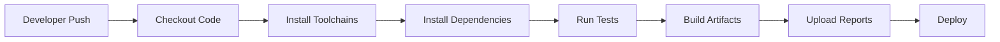

# CI/CD Guide for Smart Workspace

## 1. Purpose

This document explains CI/CD from first principles and shows how to apply it to the Smart Workspace project.

Smart Workspace is a modular monolith with:

- Backend: Java 25, Spring Boot, Gradle, Spring Security, Spring Data JPA, Flyway
- Frontend: React, TypeScript, Vite, Tailwind CSS
- Database and infrastructure: PostgreSQL, Redis, Docker Compose
- Workflow runner: GitHub Actions

The goal of CI/CD is to make every code change predictable:

1. Validate the change automatically.
2. Build the application in a clean environment.
3. Catch broken tests, broken builds, and configuration mistakes before merge.
4. Package and deploy the application through repeatable steps.

---

## 2. What CI/CD Means

### CI: Continuous Integration

Continuous Integration means developers integrate code frequently, usually through pull requests. Every push runs automated checks.

For this project, CI should answer:

- Does the backend compile?
- Do backend tests pass?
- Does the frontend TypeScript build pass?
- Does the production frontend bundle build?
- Are required environment variables present?
- Can the code be safely merged into `develop` or `main`?

Current Smart Workspace CI is defined in:

```text
.github/workflows/ci.yaml
```

It runs on pushes and pull requests targeting:

```text
main
develop
```

### CD: Continuous Delivery / Continuous Deployment

CD extends CI by preparing or performing deployment.

There are two common meanings:

- Continuous Delivery: every successful build is deployable, but production deployment needs manual approval.
- Continuous Deployment: every successful change to a target branch is deployed automatically.

For Smart Workspace, a safe recommended model is:

| Branch      | Environment | Deployment Style                          |
| ----------- | ----------- | ----------------------------------------- |
| `feature/*` | none        | CI only                                   |
| `develop`   | staging     | automatic deploy after CI                 |
| `main`      | production  | deploy after CI, preferably with approval |

---

## 3. How a CI/CD Pipeline Works

A pipeline is a sequence of automated jobs.

Typical flow:



Important concepts:

| Concept     | Meaning                                                                               |
| ----------- | ------------------------------------------------------------------------------------- |
| Workflow    | A YAML file that defines automation, such as CI or deployment.                        |
| Trigger     | Event that starts a workflow, such as `push`, `pull_request`, or manual dispatch.     |
| Job         | A group of steps that runs on a runner.                                               |
| Step        | A single command or reusable action.                                                  |
| Runner      | Machine that executes the job, such as `ubuntu-latest`.                               |
| Artifact    | File produced by the pipeline, such as test reports, build outputs, or Docker images. |
| Secret      | Sensitive value stored securely in GitHub Actions, such as passwords or tokens.       |
| Environment | Deployment target such as staging or production.                                      |

---

## 4. Current Smart Workspace CI

The current workflow has two independent jobs.

### Backend Job

The backend job:

1. Checks out the repository.
2. Installs Java 25 using Temurin.
3. Sets up Gradle caching.
4. Makes the Gradle wrapper executable.
5. Runs backend tests.
6. Uploads the backend test report if tests fail.

Equivalent local command:

```bash
cd backend
chmod +x gradlew
JWT_SECRET=test-secret-with-at-least-thirty-two-characters ./gradlew test
```

Why `JWT_SECRET` is set:

The backend application reads JWT configuration from environment variables. Tests need a valid secret so Spring can load the application context without failing configuration validation.

### Frontend Job

The frontend job:

1. Checks out the repository.
2. Installs Node.js 24.
3. Enables npm cache using `frontend/package-lock.json`.
4. Installs dependencies with `npm ci`.
5. Builds the frontend with `npm run build`.

Equivalent local command:

```bash
cd frontend
npm ci
npm run build
```

The frontend build runs:

```bash
tsc -b && vite build
```

This means CI catches both TypeScript errors and production bundle errors.

---

## 5. Workflow File Explained

Current workflow:

```yaml
name: CI

on:
  push:
    branches:
      - main
      - develop
  pull_request:
    branches:
      - main
      - develop

permissions:
  contents: read

concurrency:
  group: ci-${{ github.workflow }}-${{ github.ref }}
  cancel-in-progress: true
```

Meaning:

- `name`: display name in GitHub Actions.
- `on.push`: runs when code is pushed to `main` or `develop`.
- `on.pull_request`: runs when a pull request targets `main` or `develop`.
- `permissions.contents: read`: gives the workflow minimal repository read access.
- `concurrency`: cancels older running CI jobs for the same branch/ref when a newer push arrives.

Backend job:

```yaml
jobs:
  backend:
    name: Backend
    runs-on: ubuntu-latest

    defaults:
      run:
        working-directory: backend
```

Meaning:

- Runs on a clean Ubuntu runner.
- Every `run` command executes from the `backend` directory by default.

Frontend job:

```yaml
frontend:
  name: Frontend
  runs-on: ubuntu-latest

  defaults:
    run:
      working-directory: frontend
```

Meaning:

- Runs separately from the backend job.
- Backend and frontend checks can run in parallel.
- A frontend failure does not hide backend results, and a backend failure does not hide frontend results.

---

## 6. Local CI Parity

Before pushing, developers should be able to run the same checks locally.

Recommended local validation:

```bash
cd backend
JWT_SECRET=test-secret-with-at-least-thirty-two-characters ./gradlew test
```

```bash
cd frontend
npm ci
npm run build
```

Optional full local stack check:

```bash
cp .env.example .env
docker compose up --build
```

The Docker Compose stack starts:

- PostgreSQL
- Redis
- Backend
- Frontend served by Nginx

Use this when validating integration behavior, not for every small code change.

---

## 7. Environment Variables and Secrets

Local development uses:

```text
.env
.env.example
```

CI should not read real production secrets from `.env`. Use GitHub Actions secrets instead.

Current development variables:

| Variable                          | Purpose                  |
| --------------------------------- | ------------------------ |
| `POSTGRES_DB`                     | PostgreSQL database name |
| `POSTGRES_USER`                   | PostgreSQL username      |
| `POSTGRES_PASSWORD`               | PostgreSQL password      |
| `JWT_SECRET`                      | Secret used to sign JWTs |
| `JWT_ACCESS_TOKEN_EXPIRATION_MS`  | Access token lifetime    |
| `JWT_REFRESH_TOKEN_EXPIRATION_MS` | Refresh token lifetime   |
| `SERVER_PORT`                     | Backend port             |
| `FRONTEND_PORT`                   | Frontend port            |

Recommended GitHub secret naming:

| Secret                         | Used For                    |
| ------------------------------ | --------------------------- |
| `STAGING_POSTGRES_PASSWORD`    | Staging database access     |
| `STAGING_JWT_SECRET`           | Staging auth signing        |
| `PRODUCTION_POSTGRES_PASSWORD` | Production database access  |
| `PRODUCTION_JWT_SECRET`        | Production auth signing     |
| `DOCKERHUB_USERNAME`           | Container registry login    |
| `DOCKERHUB_TOKEN`              | Container registry push     |
| `CLOUDINARY_URL`               | File storage integration    |
| `GMAIL_SMTP_PASSWORD`          | Email notification delivery |

Rules:

- Never commit `.env` with real credentials.
- Keep `.env.example` safe and non-sensitive.
- Use separate secrets for staging and production.
- Rotate secrets if they are exposed in logs, commits, screenshots, or shared terminals.

---

## 8. Recommended CI Improvements

The existing CI is a good baseline. The next improvements should be added as the project grows.

### Add Frontend Lint

The frontend already has:

```bash
npm run lint
```

Recommended CI step:

```yaml
- name: Lint frontend
  run: npm run lint
```

Place it after `npm ci` and before `npm run build`.

### Add Backend Compile Check

Tests usually compile code, but an explicit compile step can make failures clearer.

```yaml
- name: Compile backend
  run: ./gradlew compileJava
```

### Add Dependency Caching

Already included:

- Gradle cache through `gradle/actions/setup-gradle@v4`
- npm cache through `actions/setup-node@v4`

Keep lockfiles committed:

- `backend/gradle/wrapper/gradle-wrapper.properties`
- `frontend/package-lock.json`

### Add Integration Tests Later

When repository behavior depends on PostgreSQL, Redis, Flyway migrations, or security filters, add an integration test job.

Example service-based CI shape:

```yaml
services:
  postgres:
    image: postgres:17-alpine
    env:
      POSTGRES_DB: smart_workspace
      POSTGRES_USER: smart_workspace
      POSTGRES_PASSWORD: smart_workspace
    ports:
      - 5432:5432
    options: >-
      --health-cmd "pg_isready -U smart_workspace -d smart_workspace"
      --health-interval 10s
      --health-timeout 5s
      --health-retries 5

  redis:
    image: redis:7-alpine
    ports:
      - 6379:6379
```

Use this only when tests need real services. Do not slow down the default CI unnecessarily.

---

## 9. CI Failure Strategy

A CI failure is useful only when the team knows what to do next. The goal is not just to make the pipeline red; the goal is to stop unsafe changes and give developers enough information to fix the problem quickly.

### Failure Principles

Use these rules for Smart Workspace:

- Failed CI blocks merge into `develop` and `main`.
- The author of the change owns the first investigation.
- Do not bypass failed checks unless the failure is proven unrelated and approved by a maintainer.
- Fix the root cause instead of rerunning repeatedly until the check passes.
- Keep failure output visible through logs, test reports, and artifacts.

### Failure Categories

| Failure Type                  | Example                                         | First Response                                                      |
| ----------------------------- | ----------------------------------------------- | ------------------------------------------------------------------- |
| Backend test failure          | `./gradlew test` fails                          | Open uploaded backend test report and fix the failing test or code. |
| Backend configuration failure | Missing `JWT_SECRET`                            | Add test-safe env vars to the workflow step.                        |
| Frontend dependency failure   | `npm ci` fails                                  | Check `package-lock.json`, Node version, and dependency changes.    |
| Frontend build failure        | TypeScript or Vite build error                  | Reproduce with `npm run build` locally.                             |
| Flaky test                    | Same test passes and fails without code changes | Quarantine only with an issue and owner; do not ignore silently.    |
| Infrastructure failure        | GitHub runner outage or registry timeout        | Rerun once after checking provider status.                          |
| Security failure              | Secret scan or dependency scan fails            | Treat as blocking until reviewed.                                   |

### Triage Workflow

When CI fails:

1. Identify the failed job: backend, frontend, integration, Docker build, or deploy.
2. Read the first real error, not only the final exit code.
3. Reproduce locally with the matching command.
4. Fix the code, test, dependency, or workflow configuration.
5. Push a new commit and let CI rerun.
6. If the failure is external infrastructure, rerun once and add a note to the pull request.

Local reproduction commands:

```bash
cd backend
JWT_SECRET=test-secret-with-at-least-thirty-two-characters ./gradlew test
```

```bash
cd frontend
npm ci
npm run build
```

### Retry Policy

Recommended retry policy:

| Situation                  | Retry?  | Rule                                                                 |
| -------------------------- | ------- | -------------------------------------------------------------------- |
| Deterministic test failure | No      | Fix the code or test.                                                |
| Missing configuration      | No      | Fix workflow env or secrets.                                         |
| Network timeout            | Yes     | Retry once.                                                          |
| GitHub runner issue        | Yes     | Retry once after checking status.                                    |
| Flaky test                 | Limited | Create an issue, assign owner, and fix quickly.                      |
| Deployment failure         | Careful | Do not retry production deploys blindly. Check deployed state first. |

### Pull Request Communication

For failed checks, leave a short note on the pull request:

```text
CI failed in frontend build because TypeScript rejected TaskStatus props.
Reproduced locally with npm run build.
Fix pushed in commit <sha>.
```

This keeps review context clear and prevents reviewers from guessing whether the failure is understood.

### Handling Flaky Tests

Flaky tests are dangerous because they train the team to ignore CI.

Policy:

- Mark the test as flaky only temporarily.
- Create an issue with owner, failure logs, and reproduction notes.
- Prefer fixing timing, isolation, database cleanup, or test data problems.
- Do not allow flaky tests in production deployment gates.

### When a Failure Can Be Bypassed

Bypass should be rare.

Acceptable cases:

- GitHub Actions outage confirmed by provider status.
- A non-required experimental job fails.
- A known flaky test has an active issue and is not part of deployment gating.

Not acceptable:

- Failing backend tests.
- Failing frontend production build.
- Failed migration validation.
- Failed security or secret checks.
- Failed production smoke tests.

---

## 10. CD Setup Strategy

Smart Workspace can be deployed in several ways. The most practical staged path is:

1. CI only.
2. Build Docker images.
3. Push images to a registry.
4. Deploy staging from `develop`.
5. Deploy production from `main`.

### Stage 1: Build Docker Images

Backend and frontend already have Dockerfiles:

```text
backend/Dockerfile
frontend/Dockerfile
```

Local build check:

```bash
docker compose build
```

### Stage 2: Push Images to Registry

Common registries:

- GitHub Container Registry: `ghcr.io`
- Docker Hub
- AWS Elastic Container Registry
- Google Artifact Registry

Recommended image tags:

| Tag             | Meaning                                |
| --------------- | -------------------------------------- |
| `sha-<git-sha>` | Immutable image for exact traceability |
| `develop`       | Latest staging candidate               |
| `main`          | Latest production candidate            |
| `v1.2.3`        | Release tag                            |

Avoid using only `latest` for deployments. It makes rollback and audit harder.

### Stage 3: Deploy to Staging

Trigger:

```yaml
on:
  push:
    branches:
      - develop
```

Expected behavior:

1. Run CI.
2. Build images.
3. Push images.
4. Deploy to staging.
5. Run smoke tests.

Staging should be close to production but can use smaller resources.

### Stage 4: Deploy to Production

Trigger:

```yaml
on:
  push:
    branches:
      - main
```

Production deployment should use GitHub Environments with approval.

Recommended protection:

- Require CI to pass before merge.
- Require pull request review before merge to `main`.
- Require manual approval for production environment.
- Keep production secrets only in the production environment.

---

## 11. Database Migration in CD

Smart Workspace uses Flyway through Spring Boot. Database migration must be treated as a first-class deployment step because schema changes can break a running backend even when code builds successfully.

Current backend configuration:

```yaml
spring:
  jpa:
    hibernate:
      ddl-auto: validate
  flyway:
    enabled: true
```

Meaning:

- Flyway owns schema changes.
- Hibernate validates the schema instead of creating or mutating it automatically.
- Production database changes should be explicit, versioned, reviewed, and repeatable.

### Migration File Rules

Recommended Flyway location:

```text
backend/src/main/resources/db/migration
```

Recommended naming:

```text
V1__create_users_table.sql
V2__create_workspaces_table.sql
V3__add_task_due_date.sql
```

Rules:

- Never edit a migration that has already run in staging or production.
- Add a new migration for every schema change.
- Keep migrations backward-compatible whenever possible.
- Include indexes for frequently queried foreign keys and lookup columns.
- Avoid destructive migrations in the same release as code that still depends on the old data.

### Safe Migration Deployment Order

For most releases:

```text
1. Backup database
2. Run migration validation
3. Run migrations
4. Deploy backend image
5. Deploy frontend image
6. Run smoke tests
7. Monitor application and database metrics
```

For backward-compatible changes, this is usually safe:

- Add nullable column.
- Deploy code that writes the new column.
- Backfill data.
- Deploy code that reads the new column.
- Add `NOT NULL` or stricter constraints in a later release.

For risky changes, use expand-and-contract:

```text
Release A: expand schema without breaking old code
Release B: deploy code using both old and new schema safely
Release C: migrate data and verify
Release D: remove old schema only after no code depends on it
```

### CI Checks for Migrations

Migration checks should run before deployment.

Recommended checks:

- Start PostgreSQL service in CI.
- Run backend tests against migration-managed schema.
- Run Flyway validation.
- Reject duplicate, renamed, or modified migration versions.

Example workflow shape:

```yaml
- name: Run migration validation
  run: ./gradlew flywayValidate
  env:
    SPRING_DATASOURCE_URL: jdbc:postgresql://localhost:5432/smart_workspace
    SPRING_DATASOURCE_USERNAME: smart_workspace
    SPRING_DATASOURCE_PASSWORD: smart_workspace
    JWT_SECRET: test-secret-with-at-least-thirty-two-characters
```

This requires the Flyway Gradle plugin or a project task. If the project relies only on Spring Boot startup migrations, validate by starting the application against a disposable PostgreSQL database in CI.

### CD Migration Execution

There are two common strategies.

| Strategy                    | How It Works                                            | Tradeoff                                                                             |
| --------------------------- | ------------------------------------------------------- | ------------------------------------------------------------------------------------ |
| Application-start migration | Spring Boot runs Flyway on startup.                     | Simple, but multiple app instances can make rollout behavior harder to reason about. |
| Dedicated migration job     | A separate CI/CD job runs Flyway before app deployment. | More controlled and preferred for staging/production.                                |

Recommended for Smart Workspace:

- Development: application-start migration is acceptable.
- Staging: dedicated migration job is preferred.
- Production: dedicated migration job with backup and approval is preferred.

Production migration job order:

```text
deploy-production
  needs: ci
  steps:
    backup database
    run flyway validate
    run flyway migrate
    deploy backend
    deploy frontend
    run smoke tests
```

### Rollback and Migration Risk

Application rollback is easy when images are immutable. Database rollback is harder.

Rules:

- Prefer forward fixes over down migrations in production.
- Take a backup before risky migrations.
- Do not drop columns or tables until at least one release after code stops using them.
- Avoid changing column meaning in place.
- Test migrations with realistic data volume before production.

Examples:

| Change                | Risk                  | Safer Approach                                                 |
| --------------------- | --------------------- | -------------------------------------------------------------- |
| Rename column         | Existing code breaks  | Add new column, dual write, backfill, later remove old column. |
| Add `NOT NULL` column | Existing rows invalid | Add nullable, backfill, then add constraint.                   |
| Drop table            | Data loss             | Archive, verify no reads, drop in later release.               |
| Large backfill        | Long locks            | Batch backfill outside request path.                           |

---

## 12. Example Deployment Workflow Shape

This is a template, not a ready-to-use production workflow. Adjust it to the real hosting provider.

```yaml
name: Deploy Staging

on:
  push:
    branches:
      - develop

permissions:
  contents: read
  packages: write

jobs:
  build-and-push:
    runs-on: ubuntu-latest
    steps:
      - uses: actions/checkout@v4

      - name: Login to GitHub Container Registry
        uses: docker/login-action@v3
        with:
          registry: ghcr.io
          username: ${{ github.actor }}
          password: ${{ secrets.GITHUB_TOKEN }}

      - name: Build backend image
        run: docker build -t ghcr.io/${{ github.repository }}/backend:sha-${{ github.sha }} backend

      - name: Build frontend image
        run: docker build -t ghcr.io/${{ github.repository }}/frontend:sha-${{ github.sha }} frontend

      - name: Push backend image
        run: docker push ghcr.io/${{ github.repository }}/backend:sha-${{ github.sha }}

      - name: Push frontend image
        run: docker push ghcr.io/${{ github.repository }}/frontend:sha-${{ github.sha }}
```

Deployment depends on the target platform. Examples:

- VPS: SSH into server, pull images, run `docker compose up -d`.
- Kubernetes: update manifests or Helm values and apply them.
- Render/Fly.io/Railway: call provider deployment action or API.
- AWS/GCP/Azure: push image and update service revision.

---

## 13. Quality Gates

Quality gates are checks that must pass before merge or deploy.

Recommended gates:

| Gate                | Feature Branch | Pull Request | `develop` | `main`   |
| ------------------- | -------------- | ------------ | --------- | -------- |
| Backend tests       | optional local | required     | required  | required |
| Frontend build      | optional local | required     | required  | required |
| Frontend lint       | recommended    | required     | required  | required |
| Integration tests   | optional       | recommended  | required  | required |
| Docker image build  | optional       | recommended  | required  | required |
| Security scan       | optional       | recommended  | required  | required |
| Deployment approval | none           | none         | optional  | required |

Keep gates strict on protected branches, but avoid making early feature work painfully slow.

---

## 14. Branch Protection Rules

Branch protection turns CI/CD policy into enforcement.

Recommended protected branches:

```text
main
develop
```

### `develop` Protection

Use `develop` as the integration branch and staging source.

Recommended rules:

- Require pull request before merging.
- Require at least 1 approving review.
- Require status checks to pass.
- Require branches to be up to date before merging if merge conflicts or stale CI are common.
- Require conversation resolution before merge.
- Restrict force pushes.
- Restrict deletions.

Required checks:

```text
Backend
Frontend
```

Add these when available:

```text
Frontend Lint
Integration Tests
Docker Build
Migration Validation
```

### `main` Protection

Use `main` as the production branch.

Recommended rules:

- Require pull request before merging.
- Require at least 1 or 2 approving reviews.
- Require review from code owners when ownership files are added.
- Require all CI checks to pass.
- Require branch to be up to date before merge.
- Require conversation resolution before merge.
- Block force pushes.
- Block branch deletion.
- Require signed commits if the team wants stronger provenance.
- Require deployment approval through the production GitHub Environment.

Required checks:

```text
Backend
Frontend
Integration Tests
Migration Validation
Docker Build
```

### GitHub Environment Protection

Create two GitHub Environments:

```text
staging
production
```

Recommended settings:

| Environment  | Approval | Secrets                                 |
| ------------ | -------- | --------------------------------------- |
| `staging`    | Optional | Staging database, JWT, SMTP, storage    |
| `production` | Required | Production database, JWT, SMTP, storage |

Production environment rules:

- Require manual approval.
- Limit who can approve.
- Store production-only secrets in the production environment.
- Do not expose production secrets to pull request workflows.

### Merge Strategy

Recommended:

- Feature branches merge into `develop` through squash merge or regular merge.
- `develop` merges into `main` through a release pull request.
- Do not commit directly to `main`.
- Do not deploy production from unreviewed branches.

---

## 15. Branching and Release Flow

Recommended flow:

```text
feature/my-change -> pull request -> develop -> staging
develop -> pull request -> main -> production
```

Rules:

- Work in feature branches.
- Open pull requests into `develop`.
- Merge `develop` into `main` through a release pull request.
- Tag production releases when the project needs versioned releases.

Example release tag:

```bash
git tag v0.1.0
git push origin v0.1.0
```

Tags can trigger release workflows later.

---

## 16. Observability in CI/CD

A pipeline should be debuggable.

Current observability:

- Backend test reports are uploaded when backend tests fail.
- GitHub Actions logs show every command and failure.

Recommended additions:

- Upload frontend build artifacts on failure if useful.
- Upload code coverage reports when tests are added.
- Publish test summaries into pull requests.
- Keep deployment logs linked to commit SHA.
- Store Docker image digest in deployment output.

Useful artifact examples:

| Artifact                           | Purpose                                  |
| ---------------------------------- | ---------------------------------------- |
| `backend/build/reports/tests/test` | Debug JUnit test failures                |
| `backend/build/reports/jacoco`     | Debug coverage gaps when JaCoCo is added |
| `frontend/dist`                    | Inspect production frontend output       |
| Docker image digest                | Verify exactly what was deployed         |

---

## 17. Monitoring After Deploying

Deployment is not finished when the workflow turns green. A release is complete only after the application is healthy in the target environment.

### Post-Deploy Checklist

After staging or production deployment:

1. Confirm the backend health endpoint responds.
2. Confirm the frontend loads.
3. Run smoke tests for login, workspace access, and one core task flow.
4. Check backend application logs for startup errors.
5. Check database migration status.
6. Check error rate and response time.
7. Confirm no unusual authentication failures.
8. Confirm notification and external service integrations if touched by the release.

### Health Checks

Add a backend health endpoint through Spring Boot Actuator when the project is ready:

```text
GET /actuator/health
```

Recommended health indicators:

- Application status
- PostgreSQL connectivity
- Redis connectivity
- Disk space if running on VPS
- External service readiness only if the application cannot work without it

Smoke test examples:

```bash
curl -f https://api.example.com/actuator/health
curl -f https://app.example.com
```

### Metrics to Watch

Monitor these for at least 15 to 30 minutes after production deployment:

| Metric               | Warning Sign                                  |
| -------------------- | --------------------------------------------- |
| HTTP 5xx rate        | Backend errors after deploy                   |
| HTTP 4xx spike       | Auth, routing, or frontend/API contract issue |
| API latency p95/p99  | Slow queries, locks, resource pressure        |
| JVM memory           | Memory leak or bad runtime sizing             |
| JVM CPU              | Hot loop, traffic spike, bad query pattern    |
| Database connections | Pool exhaustion or connection leak            |
| PostgreSQL locks     | Risky migration or long transaction           |
| Redis errors         | Cache/session/notification problems           |
| Frontend error rate  | Runtime JS error or broken API response       |

### Logs to Check

Backend logs:

- Spring Boot startup completed.
- Flyway migrations applied successfully.
- No repeated stack traces.
- No repeated authentication or authorization errors.
- No database connection pool errors.

Frontend logs:

- Nginx serves static assets.
- No missing asset errors.
- Browser console has no release-blocking runtime errors.

Database logs:

- No long-running migration locks.
- No repeated connection failures.
- No slow query spike caused by the release.

### Alerting

Recommended alerts:

- Backend health check fails for 2 consecutive checks.
- HTTP 5xx rate exceeds threshold for 5 minutes.
- API p95 latency exceeds target for 10 minutes.
- Database connection pool usage stays above 80%.
- PostgreSQL disk usage exceeds threshold.
- Redis unavailable.
- Deployment smoke test fails.

### Rollback Decision

Rollback when:

- Smoke tests fail in production.
- Error rate is materially above baseline.
- Login or workspace access is broken.
- Database migration caused locks or data integrity issues.
- Critical user workflows are unavailable.

Rollback order:

1. Stop or pause further rollout.
2. Identify deployed image SHA.
3. Revert application image to previous known-good SHA.
4. Verify health checks.
5. Decide whether database forward fix is needed.
6. Open an incident note with timeline, cause, and follow-up actions.

Remember: application rollback does not automatically undo database migrations. This is why migration design must be backward-compatible.

---

## 18. Security Practices

CI/CD has access to code, build artifacts, and sometimes production credentials. Treat it as privileged infrastructure.

Rules:

- Use least-privilege workflow permissions.
- Do not print secrets in logs.
- Do not pass production secrets to pull request workflows from forks.
- Use GitHub Environments for staging and production secrets.
- Keep deployment jobs separate from pull request validation jobs.
- Pin critical actions to stable major versions at minimum, such as `actions/checkout@v4`.
- Prefer short-lived cloud credentials through OIDC instead of long-lived access keys when possible.

For Smart Workspace specifically:

- JWT secrets must be different per environment.
- Database passwords must be different per environment.
- File storage and SMTP credentials must not be available in ordinary CI jobs unless tests require them.

---

## 19. Common Failures and Fixes

### Backend Tests Fail Because `JWT_SECRET` Is Missing

Symptom:

```text
Could not resolve placeholder JWT_SECRET
```

Fix:

```bash
JWT_SECRET=test-secret-with-at-least-thirty-two-characters ./gradlew test
```

In CI, set `JWT_SECRET` in the backend test step environment.

### Frontend CI Fails but Local Build Works

Common causes:

- Local `node_modules` has stale packages.
- Local Node version differs from CI.
- `package-lock.json` was not committed.

Fix:

```bash
cd frontend
rm -rf node_modules
npm ci
npm run build
```

Use Node.js 24 to match CI.

### Docker Compose Fails to Start Backend

Common causes:

- `.env` is missing.
- PostgreSQL healthcheck is failing.
- `JWT_SECRET` is missing.
- Backend port is already in use.

Fix:

```bash
cp .env.example .env
docker compose up --build
```

If a port is busy, change `SERVER_PORT` or `FRONTEND_PORT` in `.env`.

### CI Is Slow

Common fixes:

- Keep backend and frontend as separate parallel jobs.
- Use Gradle and npm caching.
- Run heavy integration tests only when needed.
- Avoid rebuilding Docker images in every pull request unless deployment depends on it.

---

## 20. Setup Checklist

Use this checklist when setting up CI/CD from scratch.

### Repository

- [ ] Add `.github/workflows/ci.yaml`.
- [ ] Protect `main` and `develop`.
- [ ] Require CI checks before merge.
- [ ] Require pull requests before merge.
- [ ] Keep `.env.example` updated.

### Backend

- [ ] Ensure `backend/gradlew` is committed.
- [ ] Ensure Java version in CI matches `build.gradle`.
- [ ] Run `./gradlew test`.
- [ ] Provide test-safe environment variables.
- [ ] Upload test reports on failure.

### Frontend

- [ ] Commit `frontend/package-lock.json`.
- [ ] Use `npm ci` in CI.
- [ ] Run `npm run lint`.
- [ ] Run `npm run build`.
- [ ] Match local Node version with CI.

### Docker

- [ ] Build backend image.
- [ ] Build frontend image.
- [ ] Validate `docker compose up --build`.
- [ ] Tag images with commit SHA.
- [ ] Push images to a registry.

### Deployment

- [ ] Create staging environment.
- [ ] Create production environment.
- [ ] Store secrets in GitHub Environments.
- [ ] Add staging deployment from `develop`.
- [ ] Add production deployment from `main`.
- [ ] Add migration validation before deployment.
- [ ] Add smoke tests after deployment.
- [ ] Add post-deployment monitoring and alert checks.
- [ ] Document rollback steps.

---

## 21. Practical Roadmap for This Project

Recommended next steps:

1. Keep the current CI workflow as the baseline.
2. Add frontend lint to CI.
3. Add a backend compile step if failures need clearer separation.
4. Add backend integration tests once database-backed features expand.
5. Add Docker image build validation.
6. Add migration validation against PostgreSQL.
7. Configure branch protection for `develop` and `main`.
8. Add staging deployment from `develop`.
9. Add production deployment from `main` with manual approval.
10. Add post-deployment monitoring checks and smoke tests.
11. Add release tagging and rollback documentation.

Suggested near-term CI workflow order:

```text
Pull Request
  Backend: compile -> test -> upload report on failure
  Frontend: npm ci -> lint -> build

develop
  CI -> migration validation -> build Docker images -> deploy staging -> smoke test -> monitor

main
  CI -> migration validation -> build Docker images -> production approval -> deploy production -> smoke test -> monitor
```

---

## 22. Glossary

| Term         | Meaning                                                                                    |
| ------------ | ------------------------------------------------------------------------------------------ |
| CI           | Continuous Integration. Automatically validates code changes.                              |
| CD           | Continuous Delivery or Continuous Deployment. Automatically prepares or performs releases. |
| Runner       | Machine that executes workflow jobs.                                                       |
| Workflow     | GitHub Actions YAML automation file.                                                       |
| Job          | Group of steps inside a workflow.                                                          |
| Step         | Single action or command inside a job.                                                     |
| Artifact     | Output saved from a workflow run.                                                          |
| Secret       | Sensitive value stored securely by GitHub.                                                 |
| Environment  | Deployment target with its own secrets and approval rules.                                 |
| Smoke Test   | Small post-deployment test that checks the application is alive.                           |
| Rollback     | Returning to a previous known-good version.                                                |
| Image Digest | Immutable identifier for a Docker image.                                                   |
